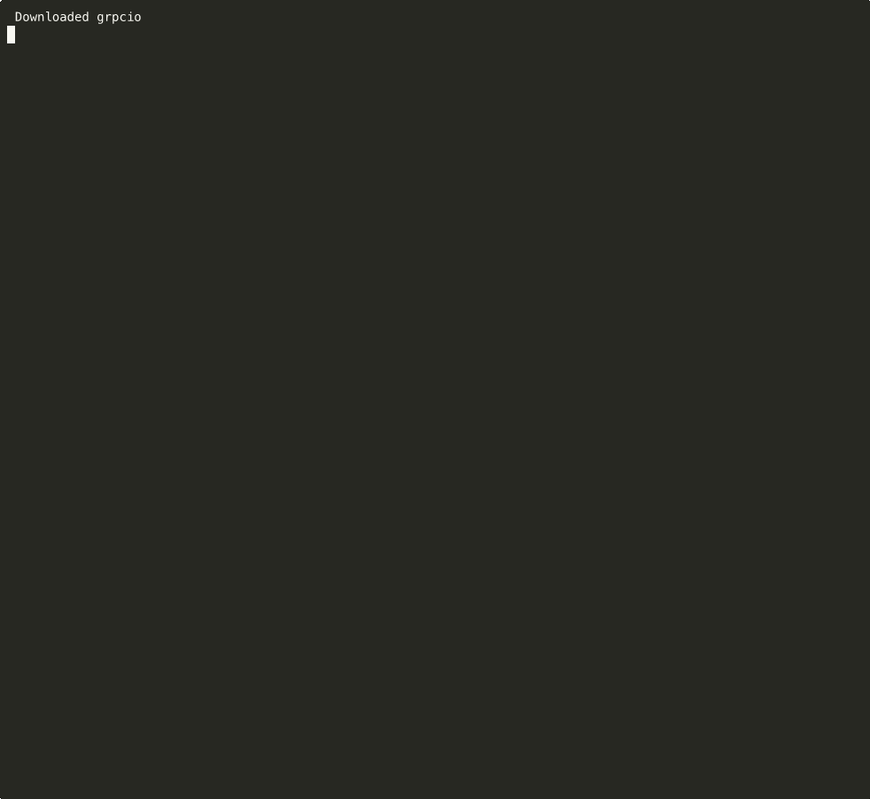

<div align="center">
  

  # Ondine

  **A prompt is a column.**
  A new DataFrame primitive for LLMs, with five dimensions of production support.

  [](https://pypi.org/project/ondine/)
  [](https://pepy.tech/project/ondine)
  [](https://opensource.org/licenses/MIT)
  [](https://www.python.org/downloads/)
  [](https://github.com/ptimizeroracle/ondine)
  [](https://github.com/ptimizeroracle/ondine/actions/workflows/ci.yml)

  **[ondine.dev](https://ondine.dev)** · **[Docs](https://docs.ondine.dev)** · **[PyPI](https://pypi.org/project/ondine/)**

  

</div>

---

Ondine makes LLM calls a first-class DataFrame operation. Define a column with natural language. Ondine computes it at production scale.

```python
from ondine import PipelineBuilder

df = (
    PipelineBuilder.create()
    .from_dataframe(df, input_columns=["review"], output_columns=["sentiment"])
    .with_prompt("Classify the tone of: {review}")
    .with_llm(provider="openai", model="gpt-5.4-mini")
    .build()
    .execute().data
)
```

The LLM stops being a service you call from your pipeline. It becomes a column function inside it.

Everything else in this README is how Ondine makes that primitive production-true across five dimensions: richer inputs (KB/RAG/OCR), constrained outputs (schemas, grounding), reliable execution (checkpoints, budget caps, adaptive concurrency), full observability, and any LLM backend.

## Install

```bash
pip install ondine
```

Python 3.10+. Works with any LLM through [LiteLLM](https://github.com/BerriAI/litellm): OpenAI, Anthropic, Groq, Mistral, Cerebras, Ollama, MLX, vLLM, SGLang, 100+ others.

## 30-second quickstart

```python
from ondine import PipelineBuilder

pipeline = (
    PipelineBuilder.create()
    .from_csv("reviews.csv",
              input_columns=["review"],
              output_columns=["sentiment", "topic"])
    .with_prompt("Classify sentiment and extract the key topic from: {review}")
    .with_llm(provider="openai", model="gpt-5.4-mini")
    .with_max_budget(5.00)
    .build()
)

result = pipeline.execute()
print(f"Processed {result.metrics.processed_rows} rows · ${result.costs.total_cost:.2f}")
```

One builder chain: input columns, prompt, model, budget cap. Multi-column outputs get a JSON parser; schema enforcement, checkpointing, and cost tracking are on by default.

Prefer a one-liner? `QuickPipeline.create(...)` wraps the same builder with sensible defaults (see [examples/](examples/)).

## The 5 dimensions

### 1. INPUTS: make the prompt richer

Feed the LLM more than raw column text. Pull context from documents, images, and prior runs.

- **Knowledge Base (RAG)**: ingest PDFs, Markdown, HTML, images via OCR. Hybrid BM25 + dense search with optional cross-encoder reranker. HyDE / multi-query / step-back query transforms.
- **OCR**: three pluggable backends: multimodal Vision LLM, Tesseract (offline), DocTR.
- **Multi-column placeholders**: use any number of input columns in one prompt (`{col_a}`, `{col_b}`).
- **Jinja2 templates** + system prompts for richer prompt shaping.

### 2. OUTPUTS: constrain what comes back

Stop parsing strings. Get typed columns, validated against your schema, verified against your evidence.

- **Pydantic structured output**: define a model, get typed columns back. Malformed JSON auto-retries up to 3x.
- **Multi-column parsing**: one prompt → N typed columns.
- **Grounding verification (Context Store)**: each LLM answer checked against an evidence graph built from your dataset. Rust + SQLite + FTS5 backend. Contradictions flagged, not silently returned.

### 3. EXECUTION: run N rows reliably

Production plumbing that `df.apply()` doesn't give you.

- **Checkpointing** to Parquet after every batch. Durable SQLite response cache for crash-atomic resume (A4, #144).
- **Hard budget caps**: pre-run cost estimation, live tracking, halts the pipeline at your USD limit.
- **Multi-row batching**: pack N rows per API call. 200 calls instead of 10,000 at `batch_size=50`.
- **Prefix caching**: system prompt cached across batches. 40–50% token savings.
- **Adaptive concurrency**: Netflix Gradient2 algorithm. Shrinks on 429, grows on saturation.
- **Retry-After** parsing across 5 header shapes (OpenAI / Anthropic / Groq / RFC 7231 / ms-delta).
- **Distributed rate limiting** via Redis (atomic Lua token bucket, cluster-aware).

### 4. OBSERVATION: see what happened

On by default. Integrates with the observability stack you already run.

- **ProgressBar + Logging + CostTracking observers** active on every run.
- **Langfuse** for LLM trace logging.
- **OpenTelemetry** for distributed tracing.
- **Prometheus** metrics export (request count, duration histogram, cost gauge).
- **Decimal precision** for cost tracking (no floating-point surprises).

### 5. PROVIDERS: any LLM backend

- **100+ providers** via LiteLLM. Swap with a string.
- **Router** with latency-based failover and automatic provider selection.
- **Local inference**: Ollama, MLX (Apple Silicon), vLLM, SGLang.
- **Azure Managed Identity** with 3 auth patterns (MI, API key, pre-fetched token).
- **Custom endpoints**: any OpenAI-compatible API.

## Beyond the quickstart

```python
from ondine import PipelineBuilder
from ondine.knowledge import KnowledgeStore
from ondine.context import RustContextStore
from pydantic import BaseModel

class ReviewAnalysis(BaseModel):
    sentiment: str
    score: int
    topic: str

kb = KnowledgeStore("knowledge.db")
kb.ingest("docs/")   # PDFs, MD, HTML, images via OCR

pipeline = (
    PipelineBuilder.create()
    .from_csv("reviews.csv",
              input_columns=["review"],
              output_columns=["sentiment", "score", "topic"])
    .with_knowledge_base(kb, top_k=5, rerank=True, query_transform="hyde")
    .with_prompt("Context:\n{_kb_context}\n\nAnalyze: {review}")
    .with_llm(provider="openai", model="gpt-5.4-mini")
    .with_structured_output(ReviewAnalysis)
    .with_context_store(RustContextStore("evidence.db"))
    .with_grounding(threshold=0.3)
    .with_batch_size(50)
    .with_max_budget(25.00)
    .with_checkpoint_interval(100)
    .with_disk_cache(".cache")
    .with_router(strategy="latency")
    .with_observer("langfuse")
    .build()
)

result = pipeline.execute()
```

Every chained method maps to one of the five dimensions. See [docs.ondine.dev](https://docs.ondine.dev) for the full reference.

## What "a prompt is a column" unlocks

Same primitive. The use case lives in the prompt.

| Transform | Prompt pattern |
|-----------|----------------|
| Classification | `"Classify {text} into one of {labels}"` |
| Extraction | `"Extract name, date, amount from: {document}"` |
| Scoring | `"Score {item} against {criteria} on 1–10"` |
| Comparison | `"Is {a} equivalent to {b}? Return yes/no + reason."` |
| Translation | `"Translate {text} from {src_lang} to {tgt_lang}"` |
| Summarization | `"Summarize {document} in 3 bullets"` |

One abstraction. Any transform.

## Compared to alternatives

| Tool | Primitive | Why pick Ondine |
|------|-----------|-----------------|
| **Instructor** | `f(prompt) → Pydantic` (one call) | Ondine applies that pattern to N rows, with the 5 dimensions |
| **Pandas-AI** | `df.chat("question")` | Different primitive (query vs. compute) |
| **LangChain batch** | `chain.batch([...])` | No budget cap, no grounding, no observability defaults |
| **OpenAI/Anthropic Batch API** | Provider-specific batch | No multi-provider, no grounding, no crash-safety, 24-hour turnaround |
| **Airflow/Prefect/Dagster** | Workflow orchestrators | Heavy setup, no LLM-specific features. Ondine ships integrations for them. |
| **Ondine** | `Prompt(columns) → new_columns` | A primitive, not a wrapper |

## Local inference

```python
from ondine import QuickPipeline

# Ollama
pipeline = QuickPipeline.create(
    data="reviews.csv",
    prompt="Classify sentiment: {review}",
    output_columns=["sentiment"],
    model="ollama/qwen3.5",
)

# MLX (Apple Silicon, native; no server process)
pipeline = QuickPipeline.create(
    data="reviews.csv",
    prompt="Classify sentiment: {review}",
    output_columns=["sentiment"],
    model="mlx/mlx-community/Llama-4-Scout-Instruct-4bit",
)
```

No API keys. No telemetry. Fully offline.

## Documentation

- **[ondine.dev](https://ondine.dev)**: landing page + examples
- **[docs.ondine.dev](https://docs.ondine.dev)**: full reference, Context Store internals, Builder API, Airflow/Prefect integrations
- **[examples/](examples/)**: 27 runnable scripts covering every major use case
- **[CHANGELOG.md](CHANGELOG.md)**: release notes

## Contributing

PRs welcome. See [CONTRIBUTING.md](CONTRIBUTING.md). Code style: Black + Ruff. Tests required for new features.

## License

MIT. See [LICENSE](LICENSE).

## Acknowledgments

- [LiteLLM](https://github.com/BerriAI/litellm): provider routing layer
- [Instructor](https://python.useinstructor.com/): the single-call pattern Ondine applies at DataFrame scale
- The Pydantic team: validation backbone

## Support

- **Issues:** https://github.com/ptimizeroracle/ondine/issues
- **Discussions:** https://github.com/ptimizeroracle/ondine/discussions
- **Website:** https://ondine.dev
