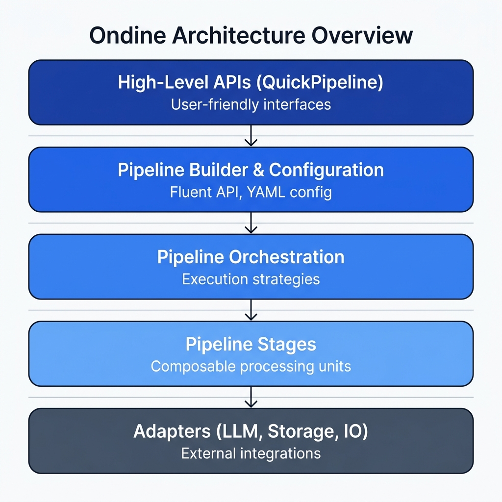
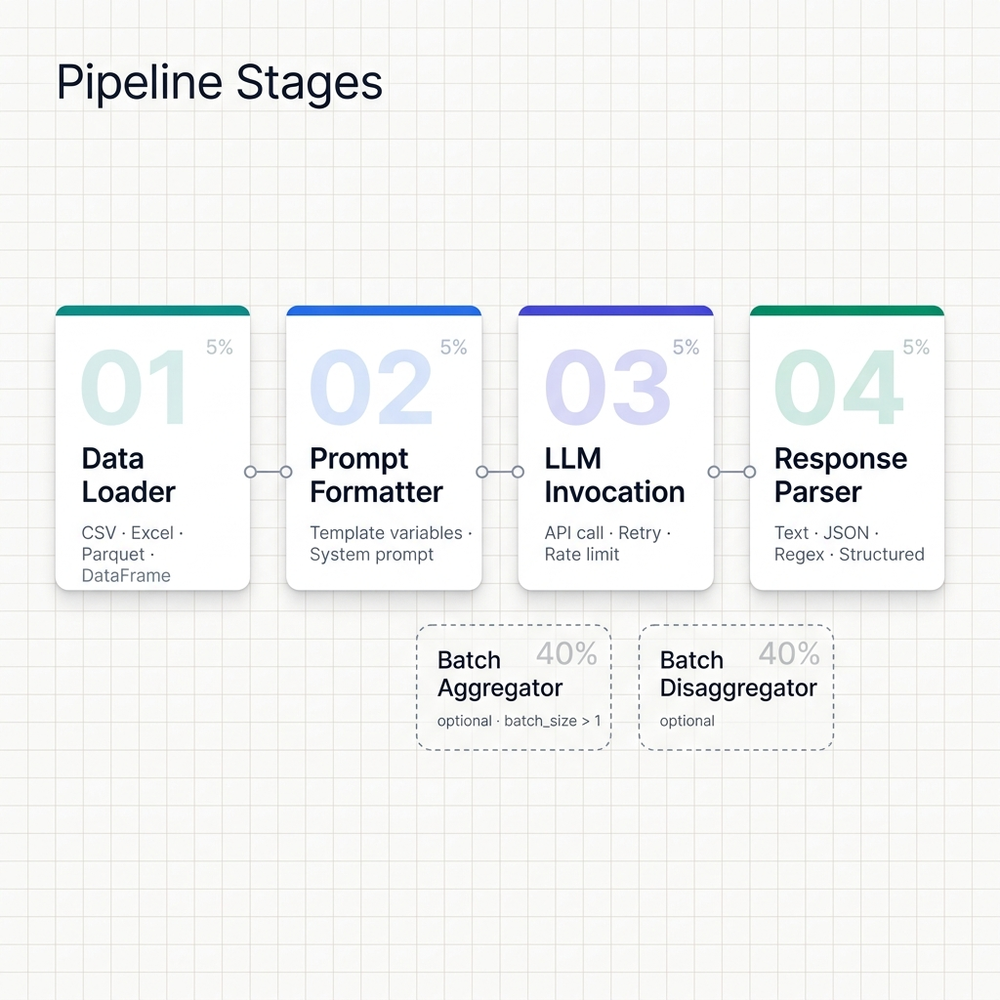

# Core Concepts

This page covers the pieces that make up an Ondine pipeline and how they connect. If something breaks, this is the mental model that will help you find the problem.

## Architecture Overview

Ondine uses a layered architecture:



## Key Components

### Pipeline

The `Pipeline` is the central execution unit. It drives data through stages in order.

```python
from ondine import Pipeline

# Pipelines are built via PipelineBuilder
pipeline = PipelineBuilder.create()...build()

# Execute synchronously
result = pipeline.execute()

# Execute asynchronously
result = await pipeline.execute_async()
```

Once built, a pipeline is immutable and thread-safe. It owns all configuration, handles checkpointing and recovery, and tracks costs and metrics throughout execution.

### Pipeline Stages

Data flows through composable stages in a fixed order:

- **DataLoaderStage** loads from CSV, Excel, Parquet, or DataFrame.
- **PromptFormatterStage** interpolates row data into your template.
- **BatchAggregatorStage** (optional) packs N prompts into a single API call.
- **LLMInvocationStage** calls the LLM with retry and rate limiting.
- **BatchDisaggregatorStage** (optional) splits the batch response back into N results.
- **ResponseParserStage** parses the LLM output (text, JSON, or regex).
- **ResultWriterStage** writes results to the output destination.

The two batch stages only appear when `batch_size > 1`. Multi-row batching can yield up to 100x fewer API calls, with automatic context-window validation and partial-failure handling.

### Pipeline Builder

`PipelineBuilder` exposes a fluent API for assembling pipelines:

```python
from ondine import PipelineBuilder

pipeline = (
    PipelineBuilder.create()
    # Data source
    .from_csv("data.csv", input_columns=["text"], output_columns=["result"])

    # Prompt configuration
    .with_prompt("Process: {text}")

    # LLM configuration
    .with_llm(provider="openai", model="gpt-4o-mini")

    # Processing configuration
    .with_batch_size(100)
    .with_concurrency(5)
    .with_retry_policy(max_retries=3)

    # Build immutable pipeline
    .build()
)
```

Available builder methods by category:

- **Data**: `from_csv()`, `from_dataframe()`, `from_parquet()`, `from_excel()`
- **Prompt**: `with_prompt()`, `with_system_prompt()`
- **LLM**: `with_llm()`, `with_llm_spec()`
- **Processing**: `with_batch_size()`, `with_concurrency()`, `with_rate_limit()`
- **Reliability**: `with_retry_policy()`, `with_checkpoint()`
- **Cost**: `with_max_budget()`
- **Execution**: `with_async_execution()`, `with_streaming()`



### Custom Stages

You can extend `PipelineStage` to insert your own processing logic:

```python
from ondine.stages import PipelineStage

class MyCustomStage(PipelineStage):
    def process(self, input_data, context):
        # Your processing logic
        return processed_data

    def validate_input(self, input_data):
        # Validation logic
        return ValidationResult(valid=True)
```

### Specifications

Configuration lives in Pydantic models. Each spec type covers one concern:

#### DatasetSpec

```python
from ondine.core.specifications import DatasetSpec

spec = DatasetSpec(
    source="data.csv",
    input_columns=["text"],
    output_columns=["result"],
    format="csv"
)
```

#### PromptSpec

```python
from ondine.core.specifications import PromptSpec

spec = PromptSpec(
    template="Summarize: {text}",
    system_prompt="You are a helpful assistant."
)
```

#### LLMSpec

```python
from ondine.core.specifications import LLMSpec

spec = LLMSpec(
    provider="openai",
    model="gpt-4o-mini",
    temperature=0.7,
    max_tokens=1000,
    api_key="sk-..."  # Or use environment variable  # pragma: allowlist secret
)
```

#### ProcessingSpec

```python
from ondine.core.specifications import ProcessingSpec

spec = ProcessingSpec(
    batch_size=100,
    concurrency=5,
    max_retries=3,
    checkpoint_interval=500,
    rate_limit=60  # requests per minute
)
```

### Execution Strategies

#### Synchronous (Default)

Sequential, single-threaded. Simplest to reason about:

```python
result = pipeline.execute()
```

Good when the dataset fits in memory and you want predictable behavior.

#### Asynchronous

Concurrent processing with async/await:

```python
pipeline = (
    PipelineBuilder.create()
    ...
    .with_async_execution(max_concurrency=10)
    .build()
)

result = await pipeline.execute_async()
```

Best when you need high throughput and the provider API supports concurrent connections.

#### Streaming

Memory-efficient processing for large datasets:

```python
pipeline = (
    PipelineBuilder.create()
    ...
    .with_streaming(chunk_size=1000)
    .build()
)

result = pipeline.execute()
```

Use this for datasets north of 100K rows or when memory is tight. See the [Execution Modes guide](../guides/execution-modes.md) for a full comparison.

### Adapters

Adapters wrap external dependencies behind stable interfaces.

#### LLM Client

All providers share a single calling convention:

```python
from ondine.adapters import LLMClient

# Automatically selected based on provider
client = create_llm_client(llm_spec)
response = client.complete(prompt, temperature=0.7)
```

Supported providers: OpenAI, Azure OpenAI, Anthropic Claude, Groq, MLX (local on Apple Silicon), and any OpenAI-compatible API.

#### Storage

Checkpoint persistence:

```python
from ondine.adapters import CheckpointStorage

storage = CheckpointStorage(path="./checkpoints")
storage.save(state)
state = storage.load()
```

#### Data IO

Reads and writes CSV, Parquet, Excel, and JSON:

```python
from ondine.adapters import DataIO

# Supports CSV, Parquet, Excel, JSON
data = DataIO.read("data.csv")
DataIO.write(data, "output.parquet")
```

## Execution Flow

When you call `pipeline.execute()`, Ondine first validates configuration and input data, then calculates an expected cost estimate. It checks for an existing checkpoint and resumes from there if one exists. Data is loaded (streaming or in-memory), prompts are formatted with input variables, and the LLM is called with rate limiting and retries. Responses are parsed and validated, results are written to the output destination, and metrics (costs, tokens, timing) are aggregated. On success, the checkpoint is cleaned up.

## Error Handling

### Automatic Retries

Failed requests retry with exponential backoff:

```python
.with_retry_policy(
    max_retries=3,
    backoff_factor=2.0,
    retry_on=[RateLimitError, NetworkError]
)
```

### Checkpointing

Resume long-running jobs after a failure:

```python
.with_checkpoint("./checkpoints", interval=100)
```

### Error Policies

Control how errors are handled:

```python
.with_error_policy("continue")  # Continue on errors
.with_error_policy("stop")      # Stop on first error
```

## Cost Tracking

Costs are tracked in real-time as requests complete:

```python
result = pipeline.execute()

print(f"Total cost: ${result.costs.total_cost:.4f}")
print(f"Input tokens: {result.costs.input_tokens}")
print(f"Output tokens: {result.costs.output_tokens}")
print(f"Cost per row: ${result.costs.total_cost / result.metrics.processed_rows:.6f}")
```

### Budget Control

Hard-cap your spend so a runaway pipeline stops before it drains your account:

```python
from decimal import Decimal

pipeline = (
    PipelineBuilder.create()
    ...
    .with_max_budget(Decimal("10.0"))  # Max $10 USD
    .build()
)

# Execution stops if budget exceeded
result = pipeline.execute()
```

## Observability

### Progress Bars

tqdm tracks progress automatically:

```
Processing: 100%|████████| 1000/1000 [00:45<00:00, 22.1rows/s]
```

### Structured Logging

JSON-formatted output via structlog:

```python
from ondine.utils import configure_logging

configure_logging(level="INFO", json_format=True)
```

### Metrics Export

Push metrics to Prometheus:

```python
from ondine.utils import MetricsExporter

exporter = MetricsExporter(port=9090)
exporter.start()
```

## Next Steps

- [Execution Modes](../guides/execution-modes.md) - Async, streaming, and when to use each
- [Structured Output](../guides/structured-output.md) - Type-safe response parsing
- [Cost Control](../guides/cost-control.md) - Budget limits and token optimization
- [API Reference](../api/index.md) - Full API documentation
