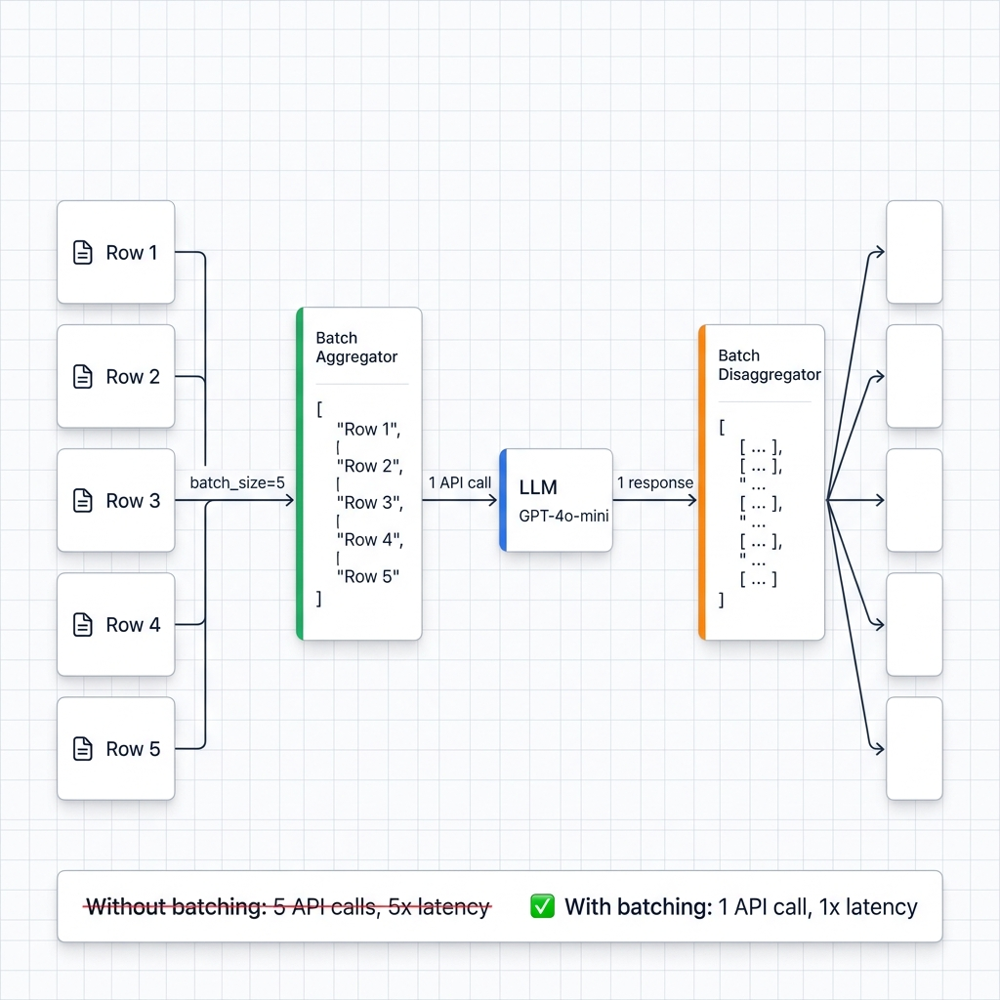

# Multi-Row Batching Guide

The single biggest throughput lever in Ondine. One flag turns 69 hours of sequential API calls into 42 minutes.

## Why Batching Matters

Every API call carries fixed overhead: TLS handshake, request serialization, queue wait, response parsing. At batch_size=1, a 5M-row dataset fires 5 million round-trips. Set batch_size=100, and you collapse that to 50,000 calls. The arithmetic is simple; the speedup is real:

- **API calls**: 100× fewer (5M down to 50K at batch_size=100)
- **Wall-clock time**: 69 hours down to 42 minutes
- **Rate limits**: practically a non-issue

<!-- IMAGE_PLACEHOLDER
title: Multi-Row Batching Flow
type: data-flow
description: Left-to-right data flow with enterprise Stripe/Vercel design language (subtle grid background, 1px connectors, #0F172A/#64748B typography). Left side: a vertical stack of 5 individual row boxes labeled "Row 1" through "Row 5", each with a small document icon. Arrow labeled "batch_size=5" points right to a single large box labeled "Batch Aggregator" with a green left-accent bar — inside show the 5 rows being combined into one JSON array. Single arrow labeled "1 API call" points right to an LLM box (blue left-accent bar, labeled "GPT-4o-mini"). Single arrow labeled "1 response" points right to a "Batch Disaggregator" box (orange left-accent bar) — inside show the JSON response being split back into 5 individual results. 5 arrows fan out right to 5 result boxes. Below the diagram, a comparison bar: "Without batching: 5 API calls, 5× latency" (red, crossed out) vs "With batching: 1 API call, 1× latency" (green, checkmark). Keep spacing generous, cards with subtle shadows.
placement: full-width
alt_text: Data flow diagram showing how multi-row batching combines 5 rows into 1 API call through batch aggregation, sends to LLM, then disaggregates the response back into 5 individual results.
-->


## Quick Start

### Basic Usage

```python
from ondine import PipelineBuilder

# Enable multi-row batching with one line
pipeline = (
    PipelineBuilder.create()
    .from_csv("data.csv", input_columns=["text"], output_columns=["sentiment"])
    .with_prompt("Classify sentiment: {text}")
    .with_batch_size(100)  # Process 100 rows per API call!
    .with_llm(provider="openai", model="gpt-4o-mini")
    .build()
)

result = pipeline.execute()
```

### How It Works

**Without Batching** (batch_size=1, default):
```
Row 1: "Product A is great" → API call 1 → "positive"
Row 2: "Product B is bad" → API call 2 → "negative"
Row 3: "Product C is okay" → API call 3 → "neutral"
...
100 rows = 100 API calls
```

**With Batching** (batch_size=100):
```
Batch prompt:
[
  {"id": 1, "input": "Product A is great"},
  {"id": 2, "input": "Product B is bad"},
  ...
  {"id": 100, "input": "Product Z"}
]
↓ 1 API call ↓
Batch response:
[
  {"id": 1, "result": "positive"},
  {"id": 2, "result": "negative"},
  ...
  {"id": 100, "result": "neutral"}
]

100 rows = 1 API call (100× reduction!)
```

## Choosing Batch Size

### Recommended Sizes by Task

| Use Case | Batch Size | Why |
|----------|------------|-----|
| Simple classification | 100-500 | Short prompts, low parse-failure risk |
| Sentiment analysis | 50-100 | Medium token load |
| Text summarization | 10-50 | Long outputs eat context fast |
| Complex extraction | 10-20 | Parsing gets fragile at scale |

### What Constrains You

**Context window.** Each row's prompt and response tokens must fit inside the model's window, multiplied by batch size. GPT-4o and GPT-4o-mini top out around 128K tokens (batch_size ~500). Claude Sonnet gives you 200K (batch_size ~800). Llama 3.1 sits at 131K (~500). Ondine validates this automatically, but understanding the math prevents surprises.

**Prompt length.** A 20-token classification prompt lets you batch 500 rows without stress. A 500-token extraction prompt with few-shot examples? Keep it under 50. The relationship is roughly inverse-linear.

**Failure risk.** Larger batches mean more rows lost when a batch fails to parse. Start at batch_size=10 for new tasks, then ratchet up once parse-error rates look stable.

## Batch Strategies

### JSON Strategy (Default)

JSON is the default because it works. Pydantic validates every field, catches malformed responses, and handles multi-field outputs cleanly. The tradeoff: roughly 200 extra tokens per batch for structural formatting. For most workloads, that overhead is negligible compared to the call-reduction savings.

```python
pipeline = (
    PipelineBuilder.create()
    .with_batch_size(100)
    .with_batch_strategy("json")  # Default, most reliable
    .build()
)
```

### CSV Strategy

If you only need one output column and want to shave tokens, CSV drops the JSON scaffolding. It is lighter, but you lose Pydantic validation and multi-field support. Good for binary classification. Bad for anything with commas in the output.

```python
pipeline = (
    PipelineBuilder.create()
    .with_batch_size(100)
    .with_batch_strategy("csv")
    .build()
)
```

## Error Handling

### Partial Failures

When the LLM drops a few rows from its response (it happens), Ondine recovers what it can:

```python
# Batch with 100 rows
# LLM returns 97 results (missing IDs: 23, 67, 89)

# Ondine automatically:
# 1. Parses 97 successful results
# 2. Marks 3 failed rows with [PARSE_ERROR]
# 3. Continues processing

# Result:
# - 97 rows: Valid results
# - 3 rows: "[PARSE_ERROR: Row not found in batch response]"
```

### Complete Failures

Sometimes the LLM ignores your formatting instructions entirely:

```python
# Batch response: "I cannot provide results in JSON format"

# Ondine automatically:
# 1. Marks all rows with [BATCH_PARSE_ERROR]
# 2. Logs error for debugging
# 3. Continues with next batch

# Result:
# - All rows: "[BATCH_PARSE_ERROR: Invalid JSON]"
```

## Performance Benchmarks

### Scaling to 5M Rows

| Batch Size | API Calls | Time | Speedup | Cost Overhead |
|------------|-----------|------|---------|---------------|
| 1 (default) | 5,000,000 | ~69 hours | 1x | 0% |
| 10 | 500,000 | ~7 hours | 10x | ~2% |
| 100 | 50,000 | ~42 minutes | 100x | ~5% |
| 500 | 10,000 | ~8 minutes | 500x | ~10% |

The cost overhead comes from JSON formatting: roughly 200 extra tokens per batch. At batch_size=100, that 5% token increase buys you a 100x speedup. The math speaks for itself.

### Worked Example: 10-Row Sentiment Job

Without batching, 10 rows means 10 API calls, ~15 seconds, and 210 tokens (21 per row). Set batch_size=5 and you get 2 calls, ~6 seconds, and 250 tokens (25 per row). That is a 20% token increase for a 2.5x wall-clock reduction. On a 5M-row dataset, the same ratio holds but the absolute savings are measured in days, not seconds.

## Combining with Prefix Caching

Batching cuts calls. Prefix caching cuts tokens. Stack them:

```python
# Shared context (cached across all rows)
SHARED_CONTEXT = """You are an expert data analyst.
[1024+ tokens of general knowledge]
"""

pipeline = (
    PipelineBuilder.create()
    .with_prompt("TASK: Classify\\nINPUT: {text}")
    .with_system_prompt(SHARED_CONTEXT)  # Cached (40-50% savings)
    .with_batch_size(100)  # 100× fewer API calls
    .with_llm(provider="openai", model="gpt-4o-mini")
    .build()
)
```

Prefix caching saves 40-50% on token cost. Batching eliminates 99% of API calls. Together, you can hit 90%+ total cost reduction while running 100x faster.

## CLI Configuration

Enable batching via YAML config:

```yaml
prompt:
  template: "Classify: {text}"
  batch_size: 100  # Multi-row batching
  batch_strategy: json
  system_message: "You are a classifier."  # Cached

llm:
  provider: openai
  model: gpt-4o-mini
```

Run with:
```bash
ondine process --config config.yaml
```

## Practical Advice

Don't jump straight to batch_size=500. Start at 10, run a few hundred rows, and check for `[PARSE_ERROR]` markers in the output. If the failure rate stays under 1%, double the batch size and retest. Keep an eye on context-window warnings in the logs, especially when prompts are long or outputs are verbose.

Before scaling to millions of rows, validate on 1,000 rows. That gives you a reliable parse-failure rate and accurate per-row timing to extrapolate from. Pair batching with prefix caching from the start; there is no reason to leave that savings on the table.

## Troubleshooting

### Many rows showing `[PARSE_ERROR]`

The LLM is failing to produce valid structured output. Drop batch_size to 10-20 and add an explicit JSON example to your prompt. If failures persist, the prompt itself is likely ambiguous. Simplify.

### Context window exceeded warnings

Your batch_size times per-row token count exceeds the model's limit. Either reduce batch_size, switch to a model with a larger context window, or trim your prompt.

### Not seeing the expected speedup

First confirm batching is actually active: print `pipeline.specifications.prompt.batch_size` and verify it is not 1. Check the logs for batch aggregation messages. If those look right, the bottleneck is probably rate limiting. Bump `rate_limit_rpm` and rerun.

## Examples

See `examples/21_multi_row_batching.py` for complete working examples:
- Example 1: Without batching (baseline)
- Example 2: With batching (5× speedup)
- Example 3: Large dataset extrapolation (5.4M rows)

## API Reference

### `with_batch_size(batch_size: int)`

Enable multi-row batching.

**Parameters:**
- `batch_size` (int): Number of rows to process per API call (1-500)

**Returns:** PipelineBuilder (for chaining)

**Raises:** ValueError if batch_size < 1 or called before with_prompt()

### `with_batch_strategy(strategy: str)`

Set batch formatting strategy.

**Parameters:**
- `strategy` (str): "json" or "csv"

**Returns:** PipelineBuilder (for chaining)

**Raises:** ValueError if strategy not supported

## Stacking with Other Features

Batching pairs well with concurrency. Set batch_size=100 and concurrency=10, and you push 1,000 rows through the pipeline simultaneously:

```python
.with_batch_size(100)  # 100 rows per call
.with_concurrency(10)  # 10 concurrent calls
# = 1000 rows processed simultaneously!
```

For datasets that do not fit in memory, add streaming so results flush to disk as batches complete:

```python
.with_batch_size(100)
.with_streaming(chunk_size=10000)
```

And prefix caching, as covered above, reduces per-batch token cost:

```python
.with_batch_size(100)
.with_system_prompt("...")  # Cached
```

## Limitations

Batch size is bounded by the model's context window. The LLM must follow JSON (or CSV) formatting instructions, and larger batches increase the blast radius of a single parse failure. These are real constraints, not edge cases.
