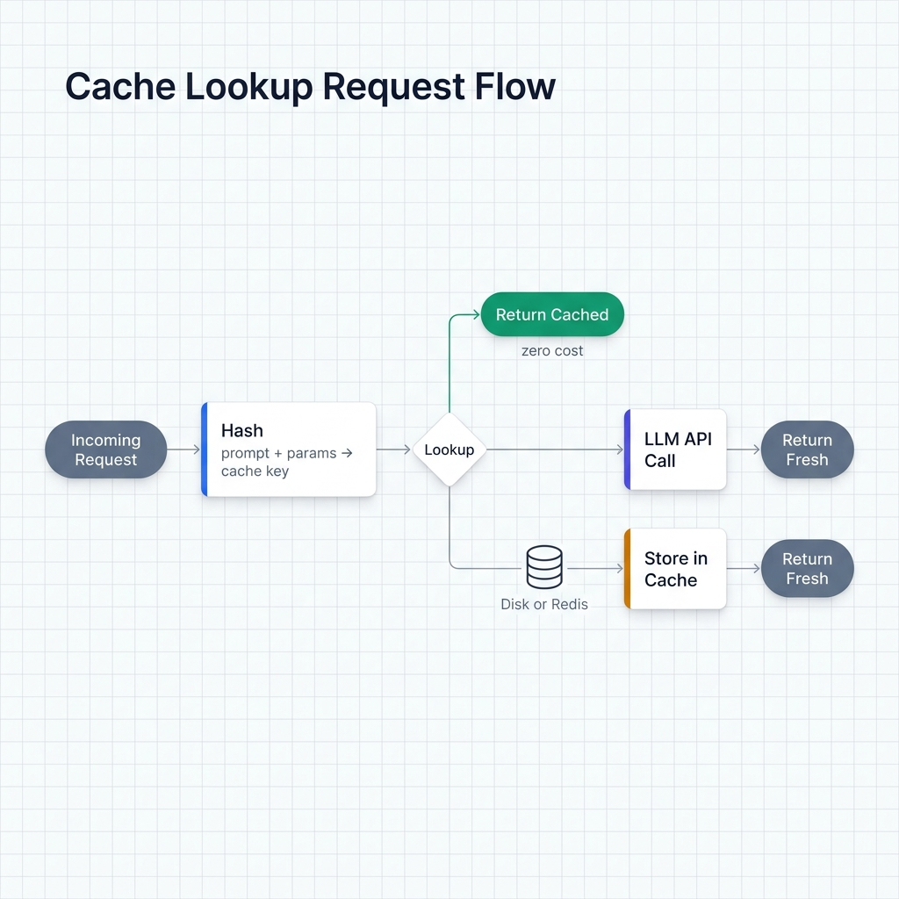
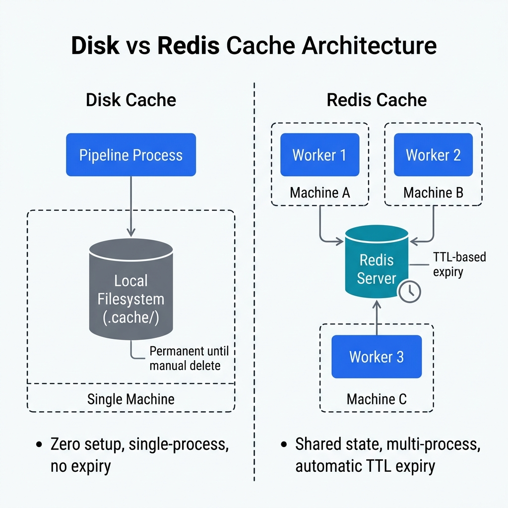

# Caching and Rate Limiting

Ondine ships two caching backends (disk and Redis) that store LLM responses and replay them on duplicate requests. No API call, no cost. Add rate limiting and you control exactly how much you spend and how fast you send.

## How Response Caching Works

When you enable caching, Ondine passes a cache config to LiteLLM. LiteLLM hashes every outgoing prompt + parameters, checks the store, and either returns the cached response (zero cost) or calls the API and writes the result for next time.

This is *not* the same as [prefix caching](cost-control.md), which is a provider-side optimization for repeated system prompts. Response caching runs on your infrastructure and skips the API call entirely.

<!-- IMAGE_PLACEHOLDER
title: Cache Lookup Request Flow
type: flowchart
description: A left-to-right flowchart showing the lifecycle of a single pipeline request through the caching layer. Nodes and edges: (1) "Incoming Request" box with prompt text and parameters feeds into (2) "Hash prompt + params" processing step, which feeds into (3) "Cache Lookup" diamond decision node. On the "HIT" branch (green arrow), flow goes to (4) "Return Cached Response" box labeled "zero cost, no API call". On the "MISS" branch (red arrow), flow goes to (5) "Call LLM API" box (labeled with provider icon), then to (6) "Store Response in Cache" box (with a dashed arrow looping back to the cache store), and finally to (7) "Return Fresh Response" box. The cache store should be depicted as a cylinder labeled "Disk or Redis" sitting between nodes 3 and 6, with bidirectional arrows (read on lookup, write on miss).
placement: full-width
alt_text: Flowchart showing how a request is hashed, checked against the cache, and either returned immediately on a hit or sent to the LLM API on a miss before the response is stored and returned.
-->


---

## Disk Caching

### `with_disk_cache(cache_dir=".cache")`

Stores responses as files on the local filesystem. No Redis required, nothing to configure.

```python
from ondine import PipelineBuilder

pipeline = (
    PipelineBuilder.create()
    .from_csv("data.csv", input_columns=["text"], output_columns=["summary"])
    .with_prompt("Summarize in one sentence: {text}")
    .with_llm(provider="openai", model="gpt-4o-mini")
    .with_disk_cache()
    .build()
)

result = pipeline.execute()
```

**Parameters**

| Parameter | Type | Default | Description |
|-----------|------|---------|-------------|
| `cache_dir` | `str` | `".cache"` | Directory to store cache files |

**Custom cache location:**

```python
.with_disk_cache(cache_dir="/tmp/ondine_cache")
```

### When disk caching makes sense

Disk caching fits local development best. You rerun the same pipeline while tweaking prompts, and after the first pass you pay nothing. It also works well for single-machine workloads where standing up Redis is overkill. Cache files persist between runs, so identical inputs always produce identical outputs. If your input data rarely changes, reprocessing becomes near-instant.

### Cost savings example

```python
# First run: 1,000 rows × $0.00015/1K tokens ≈ $0.15
# Second run (same inputs): $0.00 — all hits from cache

pipeline = (
    PipelineBuilder.create()
    .from_csv("products.csv", input_columns=["title"], output_columns=["category"])
    .with_prompt("Classify this product title into one category: {title}")
    .with_llm(provider="openai", model="gpt-4o-mini")
    .with_disk_cache(cache_dir=".cache/product_classification")
    .build()
)

# Run once to populate cache
result = pipeline.execute()
print(f"First run cost: ${result.costs.total_cost:.4f}")

# Run again — cache hits, zero cost
result2 = pipeline.execute()
print(f"Second run cost: ${result2.costs.total_cost:.4f}")  # $0.0000
```

---

## Redis Caching

### `with_redis_cache(redis_url="redis://localhost:6379", ttl=3600)`

Stores responses in Redis with TTL-based expiry. Multiple processes and machines can share the same cache.

```python
from ondine import PipelineBuilder

pipeline = (
    PipelineBuilder.create()
    .from_csv("data.csv", input_columns=["review"], output_columns=["sentiment"])
    .with_prompt("Classify sentiment as positive, negative, or neutral: {review}")
    .with_llm(provider="openai", model="gpt-4o-mini")
    .with_redis_cache(redis_url="redis://localhost:6379", ttl=3600)
    .build()
)

result = pipeline.execute()
```

**Parameters**

| Parameter | Type | Default | Description |
|-----------|------|---------|-------------|
| `redis_url` | `str` | `"redis://localhost:6379"` | Redis connection URL |
| `ttl` | `int` | `3600` | Cache TTL in seconds (1 hour) |

### When Redis caching makes sense

Use Redis when multiple workers or processes need the same cache. Disk cache lives on one machine; Redis is shared. In production, TTL handles expiry so stale data ages out without manual cleanup. Redis also avoids file locking headaches under high concurrency. If you're using `with_router()` across providers, Redis guarantees a cached response gets reused regardless of which provider would have handled the request.

### TTL configuration

Pick a TTL based on how fast your inputs change:

```python
# Short TTL — data changes daily (e.g., news classification)
.with_redis_cache(ttl=86400)  # 24 hours

# Long TTL — stable reference data (e.g., product taxonomy)
.with_redis_cache(ttl=604800)  # 7 days

# Minimum TTL — for testing or debugging only
.with_redis_cache(ttl=300)  # 5 minutes
```

### Production example with remote Redis

```python
import os
from ondine import PipelineBuilder

REDIS_URL = os.getenv("REDIS_URL", "redis://redis-host:6379")

pipeline = (
    PipelineBuilder.create()
    .from_csv("support_tickets.csv",
              input_columns=["ticket_text"],
              output_columns=["category", "priority"])
    .with_prompt("Categorize this support ticket: {ticket_text}")
    .with_llm(provider="openai", model="gpt-4o-mini")
    .with_redis_cache(redis_url=REDIS_URL, ttl=43200)  # 12 hours
    .build()
)
```

---

## Disk vs Redis: Choosing a Backend

| Consideration | Disk | Redis |
|---------------|------|-------|
| Setup | None | Redis server required |
| Multi-process | No | Yes |
| TTL / expiry | No | Yes |
| Best for | Local development | Production, distributed |
| Persistence | Permanent (manual cleanup) | Configurable via TTL |

<!-- IMAGE_PLACEHOLDER
title: Disk vs Redis Cache Architecture
type: architecture
description: A side-by-side architecture comparison with two panels. LEFT PANEL labeled "Disk Cache": a single box "Pipeline Process" at top, with an arrow down to a cylinder "Local Filesystem (.cache/)" on the same machine boundary (dashed rectangle labeled "Single Machine"). No TTL icon; a small label reads "Permanent until manual delete". RIGHT PANEL labeled "Redis Cache": three boxes at top labeled "Worker 1", "Worker 2", "Worker 3" each inside separate dashed rectangles labeled "Machine A", "Machine B", "Machine C". All three have arrows converging on a single shared cylinder labeled "Redis Server" in the center, with a small clock icon and label "TTL-based expiry". Between the two panels, a vertical dashed divider. Below each panel, a compact bullet list: Disk side shows "Zero setup, single-process, no expiry"; Redis side shows "Shared state, multi-process, automatic TTL expiry".
placement: full-width
alt_text: Architecture diagram comparing disk caching with a single process writing to local filesystem versus Redis caching with multiple distributed workers sharing a centralized Redis server with TTL-based expiry.
-->


**Disk** when you're working locally and want zero-infrastructure caching that sticks around forever.

**Redis** when you're running pipelines in parallel, across machines, or need entries to expire on their own.

---

## Cache Invalidation

Neither backend auto-invalidates when you change your prompt. Update the prompt template and old cached responses still come back for the same input values. This will bite you if you forget.

**Disk cache:** delete or rename the cache directory.

```python
import shutil

shutil.rmtree(".cache")  # Clear entire cache
# or
shutil.rmtree(".cache/product_classification")  # Clear specific run
```

**Redis cache:** flush the keys or wait for TTL expiry. Full flush during dev:

```python
import redis

r = redis.from_url("redis://localhost:6379")
r.flushdb()  # Clears all keys in the current database
```

The simplest way to dodge stale responses after a prompt change: use a namespaced cache directory for disk, or a dedicated Redis database per pipeline version.

---

## Rate Limiting

### `with_rate_limit(rpm)`

Throttles outgoing API requests with a token bucket. Set this below your provider's stated limit to avoid 429 errors.

```python
from ondine import PipelineBuilder

pipeline = (
    PipelineBuilder.create()
    .from_csv("data.csv", input_columns=["text"], output_columns=["result"])
    .with_prompt("Classify: {text}")
    .with_llm(provider="openai", model="gpt-4o-mini")
    .with_rate_limit(50)  # 50 requests per minute
    .build()
)
```

**Parameters**

| Parameter | Type | Description |
|-----------|------|-------------|
| `rpm` | `int` | Maximum requests per minute |

One catch: rate limiting is per pipeline execution, not global across processes. If you run three pipelines, each gets its own bucket.

### Provider rate limits worth knowing

| Provider / tier | Actual limit | Recommended `rpm` |
|-----------------|-------------|-------------------|
| OpenAI free | 3 RPM | 2 |
| OpenAI Tier 1 | 500 RPM | 450 |
| Groq free | 30 RPM | 25 |
| Groq paid | 6,000 RPM | 5,000 |
| Anthropic Tier 1 | 50 RPM | 45 |

Set `rpm` about 10-20% below the real limit. That headroom absorbs retries and burst traffic from other processes sharing the same API key.

### Rate limiting vs. concurrency

These two get confused. `with_concurrency()` caps how many requests are in flight at once. `with_rate_limit()` caps how many get dispatched per minute. You usually want both.

```python
pipeline = (
    PipelineBuilder.create()
    .from_csv("data.csv", input_columns=["text"], output_columns=["label"])
    .with_prompt("Label: {text}")
    .with_llm(provider="groq", model="llama-3.3-70b-versatile")
    .with_concurrency(10)     # Up to 10 simultaneous requests
    .with_rate_limit(25)      # But no more than 25 per minute total
    .build()
)
```

---

## Caching + Rate Limiting Together

All three compose freely:

```python
from ondine import PipelineBuilder

pipeline = (
    PipelineBuilder.create()
    .from_csv("reviews.csv", input_columns=["review"], output_columns=["sentiment"])
    .with_prompt("Review: {review}\nSentiment:")
    .with_system_prompt("Classify as positive, negative, or neutral. Return only the label.")
    .with_llm(provider="openai", model="gpt-4o-mini")
    .with_redis_cache(redis_url="redis://localhost:6379", ttl=86400)
    .with_rate_limit(50)
    .with_concurrency(10)
    .build()
)

result = pipeline.execute()
print(f"Total cost: ${result.costs.total_cost:.4f}")
print(f"Total tokens: {result.costs.total_tokens:,}")
```

Cache hits bypass rate limiting entirely. No API call, no throttle. For repeated data your effective throughput is uncapped.

---

## Related

- [Cost Control](cost-control.md) — prefix caching, budget limits, and token optimization
- [Routing](routing.md) — load balancing and failover across multiple providers
- [Execution Modes](execution-modes.md) — concurrency and streaming configuration
