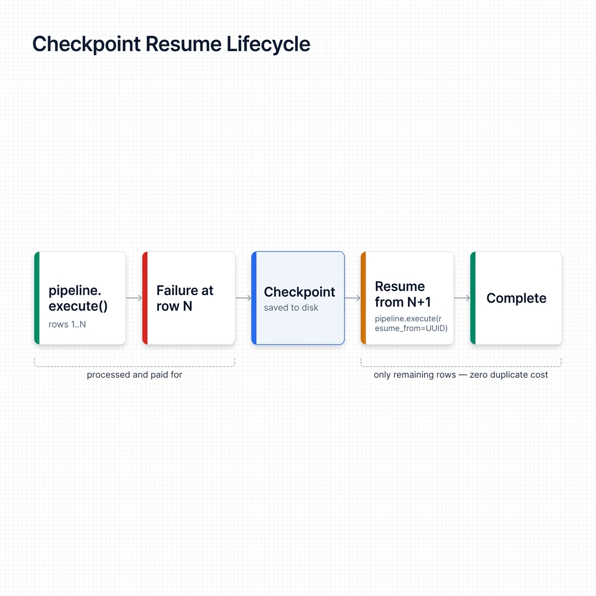
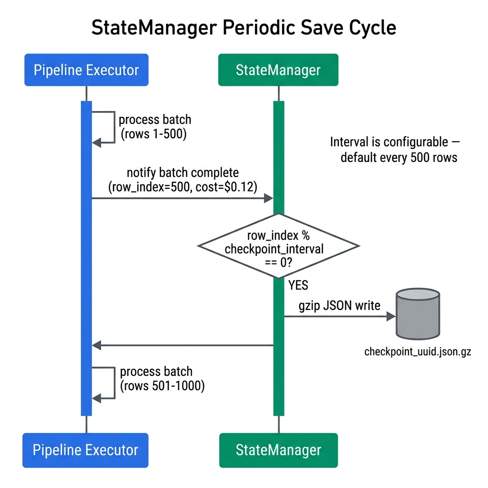

# Checkpointing

Checkpointing saves pipeline state to disk as it runs. Crash, network blip, Ctrl+C. You pick up from the last saved position instead of row zero, and every LLM call you already paid for stays paid for.

## Quick Reference

| Feature | Default | Notes |
|---------|---------|-------|
| Checkpoint directory | `.checkpoints/` | Configurable via `with_checkpoint_dir()` |
| Checkpoint interval | Every 500 rows | Configurable via `with_checkpoint_interval()` |
| Cleanup on success | Enabled | Configurable via `with_checkpoint_cleanup()` |
| Storage format | Gzip-compressed JSON | Human-readable, compact |

## How It Works

<!-- IMAGE_PLACEHOLDER
title: Checkpoint Resume Lifecycle
type: flowchart
description: A horizontal flowchart with five rounded-rect nodes connected by arrows, left to right. Node 1 "pipeline.execute()" (green) arrow labeled "processing rows 1..N" to Node 2 "Failure at row N" (red). Node 2 arrow labeled "StateManager saves state" to Node 3 "Checkpoint file on disk" (blue, icon of a floppy/file). Node 3 arrow labeled "pipeline.execute(resume_from=UUID)" to Node 4 "Resume from row N+1" (orange). Node 4 arrow labeled "processing rows N+1..end" to Node 5 "Complete" (green). Below Nodes 1-2 a dashed annotation reads "Rows 1..N processed and paid for". Below Nodes 4-5 a dashed annotation reads "Only remaining rows processed -- zero duplicate LLM cost". The overall flow direction is left-to-right.
placement: full-width
alt_text: Flowchart showing the checkpoint-resume lifecycle: execute, fail at row N, save checkpoint, resume from row N, complete with no duplicate cost.
-->


The `StateManager` periodically serialises execution context (last processed row index, accumulated cost, aggregate counters) into a compressed JSON file, and every completed LLM response streams row-by-row into a SQLite database next to it:

```
.checkpoints/checkpoint_<session-uuid>.json.gz   # counters, small
.checkpoints/responses.db                         # one row per completed LLM call
```

**Why two files?** The JSON blob used to also carry every completed response inline — that rewrote a ~100MB file every checkpoint window (O(N²) IO on long runs) and could be truncated mid-write by a `kill -9`. The SQLite file uses WAL mode and appends one row per response atomically, so:

- A hard kill between any two rows leaves **every completed row intact**. No partial writes.
- Checkpoint windows stay small — only counters are rewritten.
- Resume reads responses back in `row_index` order regardless of worker completion order.

The `responses.db` is managed for you. It's cleared automatically on successful completion (unless you disable cleanup) and reattached by path when you resume.

When execution fails, the logs hand you a ready-to-paste resume call:

```
Pipeline failed. Checkpoint saved.
Resume with: pipeline.execute(resume_from=UUID('e650ee2a-0c71-4761-ac3f-bdab8ecd920b'))
```

Paste that line back in and the pipeline skips everything already done. No duplicate LLM spend.

## Builder Methods

### `with_checkpoint_dir(directory: str)`

Sets the directory for checkpoint files. Created automatically if missing.

```python
pipeline = (
    PipelineBuilder.create()
    .from_csv("data.csv", input_columns=["text"], output_columns=["result"])
    .with_prompt("Summarise: {text}")
    .with_llm(provider="openai", model="gpt-4o-mini")
    .with_checkpoint_dir("/var/checkpoints/my-job")
    .build()
)
```

**Default:** `.checkpoints` (relative to working directory).

<!-- IMAGE_PLACEHOLDER
title: StateManager Periodic Save Cycle
type: sequence-diagram
description: A vertical sequence diagram with two lifelines -- "Pipeline Executor" on the left and "StateManager" on the right. Step 1 Pipeline Executor sends "process batch (rows 1-500)" to itself (self-arrow). Step 2 after batch completes, Pipeline Executor sends "notify batch complete (row_index=500, cost=$0.12)" to StateManager. Step 3 StateManager checks "row_index % checkpoint_interval == 0?" with a decision diamond. If yes, Step 4 StateManager serialises state to box labeled "checkpoint_<uuid>.json.gz" on disk (drawn as a cylinder to the right). Arrow from StateManager to cylinder labeled "gzip JSON write". Step 5 control returns to Pipeline Executor which sends "process batch (rows 501-1000)" self-arrow. Step 6 same notify/check/write cycle repeats. A note on the right side reads "Interval is configurable -- default every 500 rows".
placement: full-width
alt_text: Sequence diagram showing the StateManager saving checkpoints to disk at regular intervals as the pipeline executor processes batches of rows.
-->


### `with_checkpoint_interval(rows: int)`

Controls how many rows pass between writes. Lower values mean less re-work after a crash but more disk I/O. For most jobs the default of 500 is fine.

```python
pipeline = (
    PipelineBuilder.create()
    .from_csv("data.csv", input_columns=["text"], output_columns=["result"])
    .with_prompt("Analyse: {text}")
    .with_llm(provider="openai", model="gpt-4o-mini")
    .with_checkpoint_interval(100)   # Checkpoint every 100 rows
    .build()
)
```

**Default:** `500` rows.

Rough sizing guide:

| Dataset Size | Recommended Interval |
|-------------|---------------------|
| < 5K rows | 100 |
| 5K–50K rows | 500 |
| 50K–500K rows | 1,000–2,000 |
| 500K+ rows | 5,000 |

### `with_checkpoint_cleanup(enabled: bool = True)`

Controls whether checkpoint files get deleted after a successful run.

- `True` (default) -- deletes checkpoints once the pipeline returns successfully.
- `False` -- keeps them. Use this when downstream code (database writes, S3 uploads) might fail after the pipeline itself finishes. The checkpoint lets you resume without re-running LLM calls.

```python
pipeline = (
    PipelineBuilder.create()
    .from_csv("data.csv", input_columns=["text"], output_columns=["result"])
    .with_prompt("Classify: {text}")
    .with_llm(provider="openai", model="gpt-4o-mini")
    .with_checkpoint_cleanup(False)   # Keep checkpoint as safety net
    .build()
)
```

## Resuming a Failed Pipeline

When a pipeline fails it prints a session UUID. Pass that UUID back to `execute()`:

```python
from uuid import UUID
from ondine import PipelineBuilder

# Original pipeline definition -- must be identical to the failed run
pipeline = (
    PipelineBuilder.create()
    .from_csv("data.csv", input_columns=["text"], output_columns=["result"])
    .with_prompt("Summarise: {text}")
    .with_llm(provider="openai", model="gpt-4o-mini")
    .with_checkpoint_dir(".checkpoints")
    .build()
)

# Resume from the checkpoint saved by the interrupted run
result = pipeline.execute(resume_from=UUID("e650ee2a-0c71-4761-ac3f-bdab8ecd920b"))
print(f"Resumed. Processed {result.metrics.processed_rows} rows total.")
```

Works with async too:

```python
result = await pipeline.execute_async(
    resume_from=UUID("e650ee2a-0c71-4761-ac3f-bdab8ecd920b")
)
```

## Practical Patterns

### Overnight Batch Job

For long-running jobs, checkpoint frequently and keep the files after success. If the DB write blows up at 3 AM you still have every LLM response on disk.

```python
from ondine import PipelineBuilder

pipeline = (
    PipelineBuilder.create()
    .from_csv(
        "500k_records.csv",
        input_columns=["description"],
        output_columns=["category", "tags"],
    )
    .with_prompt("Classify this product description: {description}")
    .with_llm(provider="openai", model="gpt-4o-mini")
    .with_checkpoint_dir("/data/checkpoints/product-classification")
    .with_checkpoint_interval(500)
    .with_checkpoint_cleanup(False)   # Keep until DB write confirmed
    .with_max_budget(50.0)
    .build()
)

result = pipeline.execute()
write_to_database(result.to_pandas())   # If this fails, you can resume
```

### Auto-Resume Script

Wrap `execute()` so you can capture the session ID on failure and re-run without manual copy-paste:

```python
import logging
from uuid import UUID
from ondine import PipelineBuilder

log = logging.getLogger(__name__)

def build_pipeline():
    return (
        PipelineBuilder.create()
        .from_csv("data.csv", input_columns=["text"], output_columns=["result"])
        .with_prompt("Process: {text}")
        .with_llm(provider="openai", model="gpt-4o-mini")
        .with_checkpoint_dir(".checkpoints")
        .with_checkpoint_interval(250)
        .build()
    )

def run(resume_from: UUID | None = None):
    pipeline = build_pipeline()
    try:
        return pipeline.execute(resume_from=resume_from)
    except Exception as e:
        # The pipeline logs the session UUID automatically.
        # Extract it from result.execution_id if you need it programmatically.
        log.error(f"Pipeline failed: {e}")
        raise

# First attempt
result = run()

# On a subsequent attempt after a failure, pass the UUID from the log:
# result = run(resume_from=UUID("..."))
```

### Listing Checkpoints

`LocalFileCheckpointStorage` lets you browse available checkpoints before deciding which to resume:

```python
from pathlib import Path
from ondine.adapters.checkpoint_storage import LocalFileCheckpointStorage

storage = LocalFileCheckpointStorage(checkpoint_dir=Path(".checkpoints"))

for info in storage.list_checkpoints():
    print(
        f"Session: {info.session_id} | "
        f"Rows: {info.rows_processed}/{info.total_rows} | "
        f"Cost so far: ${info.cost_so_far:.4f} | "
        f"Saved: {info.timestamp:%Y-%m-%d %H:%M}"
    )
```

### Cleaning Up Old Checkpoints

```python
from pathlib import Path
from ondine.adapters.checkpoint_storage import LocalFileCheckpointStorage

storage = LocalFileCheckpointStorage(checkpoint_dir=Path(".checkpoints"))
deleted = storage.cleanup_old_checkpoints(days=7)
print(f"Deleted {deleted} old checkpoint files.")
```

## When NOT to Use Checkpointing

**Small datasets (< 1K rows).** The pipeline finishes in seconds. Checkpointing adds overhead with no real safety gain.

**Cheap, idempotent pipelines.** If re-processing from scratch costs less than thinking about checkpoint state, just rerun.

**Streaming mode.** `execute_stream()` delivers results incrementally, so checkpointing belongs at the chunk level, not the row level.

## Related

- [Execution Modes](execution-modes.md) -- choosing between standard, async, and streaming
- [Cost Control](cost-control.md) -- budget limits to pair with long-running jobs
- [Error Handling](error-handling.md) -- retry policies for transient failures
