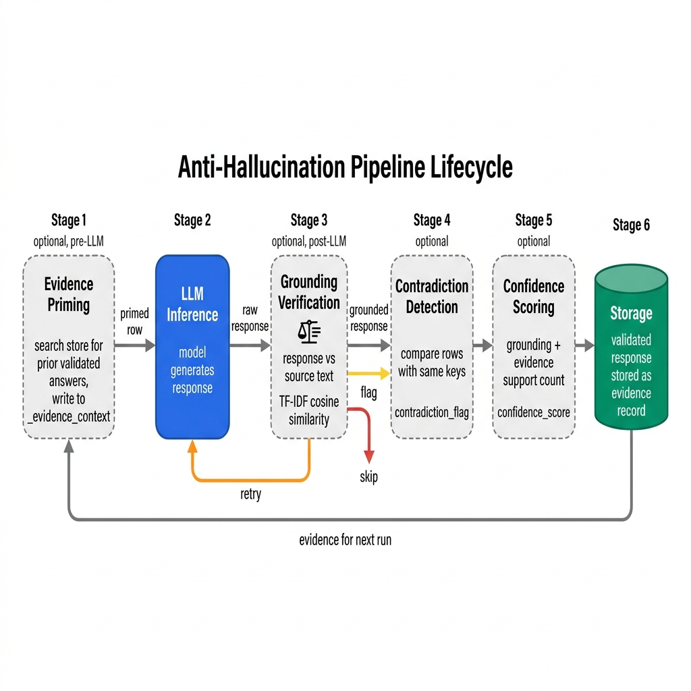
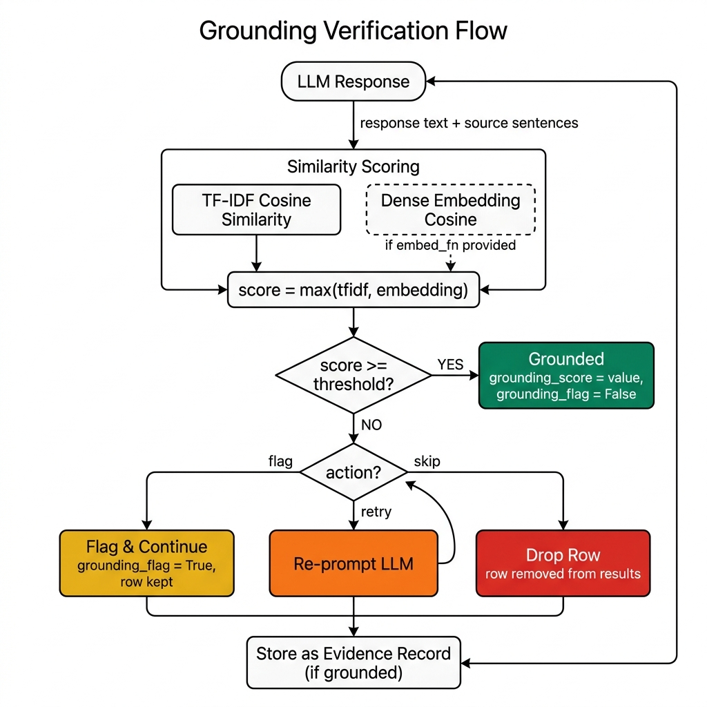
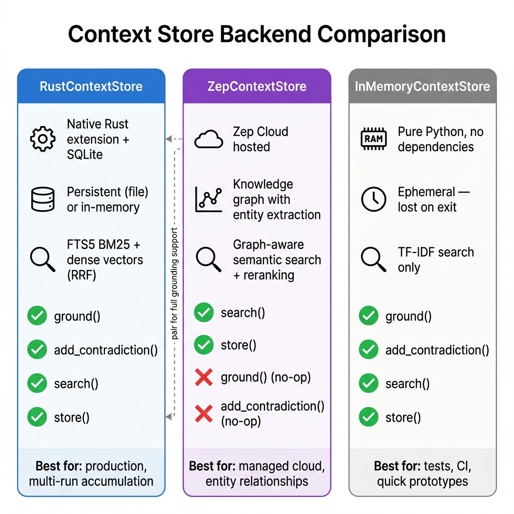

# Context Store and Anti-Hallucination

The context store gives your pipeline memory. Every LLM output becomes an evidence record. Future runs retrieve it, verify it against source text, check for contradictions. Wire up the pieces you need -- priming, grounding, contradiction detection, confidence scoring -- and ignore the rest.

## How it works

Attach a context store and each row flows through up to six stages:

1. **Evidence priming** (optional, pre-LLM) -- searches the store for prior validated answers relevant to the current row. Top-k results land in `_evidence_context`.
2. **LLM inference** -- the model generates a response, optionally informed by primed evidence.
3. **Grounding verification** (optional, post-LLM) -- compares the response against source text using TF-IDF cosine similarity (or dense embeddings if you supply an `embed_fn`). Scores below the threshold get flagged.
4. **Contradiction detection** (optional) -- rows sharing the same key columns but producing different outputs get flagged.
5. **Confidence scoring** (optional) -- a composite score from grounding similarity and evidence support count, written to `confidence_score`.
6. **Storage** -- validated responses go into the store as evidence records for next time.

<!-- IMAGE_PLACEHOLDER
title: Anti-Hallucination Pipeline Lifecycle
type: data-flow
description: A left-to-right pipeline diagram showing six stages as rounded boxes connected by arrows, with a feedback loop. Stage 1 "Evidence Priming" (dashed border, labeled "optional, pre-LLM") — inside label "search store for prior validated answers, write to _evidence_context". Arrow labeled "primed row" points right to Stage 2 "LLM Inference" (solid blue box) — label "model generates response, informed by evidence". Arrow labeled "raw response" points right to Stage 3 "Grounding Verification" (dashed border, labeled "optional, post-LLM") — inside show a comparison icon with labels "response vs source text", "TF-IDF cosine similarity (or dense embeddings)", and three outcome branches below: "flag" (yellow), "retry" (orange, loops back to Stage 2 with a curved arrow), "skip" (red, arrow to a trash icon). Arrow labeled "grounded response" points right to Stage 4 "Contradiction Detection" (dashed border, labeled "optional") — inside label "compare with prior rows sharing same key columns", output "contradiction_flag". Arrow points right to Stage 5 "Confidence Scoring" (dashed border, labeled "optional") — inside label "composite of grounding score + evidence support count", output "confidence_score". Arrow points right to Stage 6 "Storage" (green cylinder) — label "validated response stored as evidence record". A large curved feedback arrow goes from Stage 6 back to Stage 1, labeled "evidence available for next run". Use blue for the LLM box, green for storage, dashed gray borders for optional stages.
placement: full-width
alt_text: Data flow diagram of the six-stage anti-hallucination pipeline: evidence priming, LLM inference, grounding verification, contradiction detection, confidence scoring, and storage, with a feedback loop from storage back to evidence priming for subsequent runs.
-->


---

## Store backends

### RustContextStore

The default. Compiles to a native extension (`ondine._engine`) backed by SQLite with FTS5 full-text search. You get hybrid search (TF-IDF sparse + optional dense embeddings via Reciprocal Rank Fusion), persistent storage across runs, and contradiction tracking.

```python
from ondine.context import RustContextStore

# Persistent database — survives between runs
store = RustContextStore("evidence.db")

# In-memory (Rust speed, no persistence)
store = RustContextStore(":memory:")
```

This is what you want for production. Multi-run datasets, accumulated evidence, the works.

Requires the compiled Rust extension. `pip install ondine` handles it -- you only need a Rust toolchain when building from source.

### ZepContextStore

Cloud-hosted knowledge graph backed by [Zep Cloud](https://www.getzep.com/). Zep extracts entities and relationships from stored text automatically, so you get graph-aware semantic search with cross-encoder reranking out of the box.

```python
from ondine.context import ZepContextStore

# Uses ZEP_API_KEY environment variable
store = ZepContextStore(graph_id="my-pipeline-run")

# Explicit API key
store = ZepContextStore(graph_id="my-pipeline-run", api_key="zep-...")
```

Each `graph_id` is an isolated namespace. Share one across pipeline runs for cross-run memory, or use separate graphs to keep experiments from contaminating each other. Defaults to a random UUID if you don't specify one.

Best fit: managed cloud storage, persistent knowledge graphs, or cases where Zep's entity/relationship extraction does the heavy lifting for you.

Requires `pip install ondine[zep]` and a `ZEP_API_KEY` environment variable (or explicit `api_key`).

`ZepContextStore.available` returns `False` if the client couldn't initialize (missing package or bad key). It degrades gracefully -- `search()` returns an empty list -- so your pipeline won't crash just because Zep is down.

### InMemoryContextStore

Pure-Python fallback. Zero external dependencies. Same TF-IDF algorithm as the Rust backend, just slower. Everything vanishes when the process exits.

```python
from ondine.context import InMemoryContextStore

store = InMemoryContextStore()
```

Good for unit tests, CI where you can't compile Rust, quick prototyping. Nothing more.

---

## Working with stores directly

All three backends implement the `ContextStore` protocol:

```python
from ondine.context import RustContextStore, EvidenceRecord

store = RustContextStore("evidence.db")

# Store an evidence record
claim_id = store.store(EvidenceRecord(
    text="Paris is the capital of France.",
    source_ref="geography-101",
    claim_type="factual",       # "factual", "opinion", etc.
    source_type="document",     # "document", "llm_response", "user_correction", "external"
    asserted_by="pipeline",
    confidence=0.95,
))

# Retrieve by ID
record = store.retrieve(claim_id)

# Search by query
results = store.search("capital of France", limit=5)
for r in results:
    print(f"[{r.score:.2f}] {r.text}  (source: {r.source_ref})")

# Ground an LLM response against source sentences
groundings = store.ground(
    response_text="Paris is the capital of France.",
    source_sentences=["Paris is where the French government is based.", "France is in Western Europe."],
    threshold=0.3,
)
for g in groundings:
    print(f"grounded={g.grounded}  confidence={g.confidence:.2f}")

# Record a contradiction between two claims
store.add_contradiction(claim_id_a, claim_id_b)
contradicted_by = store.get_contradictions(claim_id_a)

store.close()
```

### EvidenceRecord fields

| Field | Type | Default | Description |
|---|---|---|---|
| `text` | `str` | required | The evidence text |
| `source_ref` | `str` | `""` | Reference to the source document or URL |
| `claim_type` | `str` | `"factual"` | Semantic type of the claim |
| `source_type` | `str` | `"llm_response"` | One of `"document"`, `"llm_response"`, `"user_correction"`, `"external"` |
| `asserted_by` | `str` | `"pipeline"` | Who/what asserted the claim |
| `claim_id` | `str \| None` | `None` | If None, a UUID is assigned on store |
| `confidence` | `float \| None` | `None` | Optional confidence score (0.0--1.0) |
| `metadata` | `dict` | `{}` | Arbitrary key-value metadata |

### RetrievalResult fields

| Field | Type | Description |
|---|---|---|
| `text` | `str` | Evidence text |
| `score` | `float` | Relevance score (higher is more relevant) |
| `claim_id` | `str` | ID of the stored claim |
| `source_ref` | `str` | Source reference |
| `support_count` | `int` | How many times this claim has been reinforced |

---

## Pipeline builder API

### with_context_store()

Attaches a context store to the pipeline. Every other anti-hallucination method needs a store. If you forget this call, the builder adds one for you.

```python
def with_context_store(
    store: ContextStore | None = None,
) -> PipelineBuilder
```

- `store` -- A `ContextStore` instance. Pass `None` and the builder picks for you: it tries `RustContextStore` (in-memory) first, then falls back to `InMemoryContextStore` if the Rust extension isn't available.

```python
from ondine import PipelineBuilder
from ondine.context import RustContextStore

pipeline = (
    PipelineBuilder.create()
    .from_csv("data.csv", input_columns=["question"], output_columns=["answer"])
    .with_prompt("Answer: {question}")
    .with_llm(model="openai/gpt-4o-mini")
    .with_context_store(RustContextStore("evidence.db"))
    .build()
)
```

Here's the thing: if you want evidence to persist across runs, pass an explicit store with a file path. The auto-detected store uses `":memory:"` and throws everything away on exit.

---

### with_evidence_priming()

Before LLM inference, this searches the store for prior validated answers that match the current row. Top-k results land in `_evidence_context` and `_evidence_count`. Reference `_evidence_context` in your prompt template and the formatter picks it up automatically.

```python
def with_evidence_priming(
    query_columns: list[str] | None = None,
    *,
    top_k: int = 3,
    min_score: float = 0.1,
) -> PipelineBuilder
```

- `query_columns` -- Input columns to concatenate as the search query. Defaults to the pipeline's input columns.
- `top_k` -- Max evidence records retrieved per row.
- `min_score` -- Minimum relevance score (0.0--1.0). Anything below this gets thrown out. Low-scoring evidence is just noise in your prompt.

First run? The store is empty, so priming is a no-op. Evidence accumulates as grounding and verification store validated claims. Second run onward is where you see the benefit.

```python
pipeline = (
    PipelineBuilder.create()
    .from_csv("data.csv", input_columns=["product"], output_columns=["category"])
    .with_prompt(
        "Prior evidence:\n{_evidence_context}\n\n"
        "Classify this product: {product}\n\nCategory:"
    )
    .with_llm(model="openai/gpt-4o-mini")
    .with_context_store(RustContextStore("evidence.db"))
    .with_evidence_priming(query_columns=["product"], top_k=3, min_score=0.2)
    .build()
)
```

The `_evidence_context` column looks like this:

```
[score=0.87](source: classification-run-1) Produce
---
[score=0.72](source: classification-run-1) Snacks
```

---

### with_grounding()

Post-inference reality check. Compares each LLM response against its source text and scores the similarity. Adds `grounding_score` (float, 0--1) and `grounding_flag` (bool, `True` when below threshold).

```python
def with_grounding(
    threshold: float = 0.3,
    action: str = "flag",
    embed_fn: callable | None = None,
) -> PipelineBuilder
```

- `threshold` -- Minimum similarity for a response to count as grounded (0.0--1.0).
- `action` -- What happens to ungrounded responses:
  - `"flag"` (default) -- adds the score and flag columns, keeps going.
  - `"retry"` -- re-prompts the LLM for that row.
  - `"skip"` -- drops the ungrounded row entirely.
- `embed_fn` -- Optional callable: `(list[str]) -> list[list[float]]`. When provided, dense embedding cosine similarity runs alongside TF-IDF. Final score is `max(tfidf_score, embedding_score)`. This matters because embeddings catch semantic matches that TF-IDF misses when the vocabulary differs.

<!-- IMAGE_PLACEHOLDER
title: Grounding Verification Flow
type: flowchart
description: A top-to-bottom flowchart showing how grounding verification decides the fate of an LLM response. Start with "LLM Response" rounded box at top. Arrow labeled "response text + source sentences" goes down to a box "Similarity Scoring" split into two parallel paths: left path "TF-IDF Cosine Similarity" and right path "Dense Embedding Cosine (if embed_fn provided)" shown with dashed border. Both paths feed into a merge node labeled "score = max(tfidf, embedding)". Arrow goes down to a diamond decision node "score >= threshold?". Yes branch goes right to a green box "Grounded" with outputs "grounding_score = value, grounding_flag = False". No branch goes down to a second diamond "action?". Three branches from this diamond: left branch labeled "flag" goes to yellow box "Flag & Continue" with output "grounding_flag = True, row kept"; middle branch labeled "retry" goes to orange box "Re-prompt LLM" with a curved arrow looping back to "LLM Response" at the top; right branch labeled "skip" goes to red box "Drop Row" with output "row removed from results". All terminal boxes feed into a bottom box "Store as Evidence Record (if grounded)".
placement: full-width
alt_text: Flowchart showing grounding verification: LLM response is scored against source text via TF-IDF and optional dense embeddings, then compared to the threshold. Grounded responses pass through; ungrounded ones are flagged, retried, or skipped depending on the configured action.
-->


```python
# Basic grounding with flag action
pipeline = (
    PipelineBuilder.create()
    .from_csv("data.csv", input_columns=["text"], output_columns=["summary"])
    .with_prompt("Summarize: {text}")
    .with_llm(model="openai/gpt-4o-mini")
    .with_context_store(RustContextStore("evidence.db"))
    .with_grounding(threshold=0.3, action="flag")
    .build()
)
```

```python
# Grounding with dense embeddings for better recall
from openai import OpenAI

client = OpenAI()

def embed(texts: list[str]) -> list[list[float]]:
    response = client.embeddings.create(
        input=texts,
        model="text-embedding-3-small",
    )
    return [item.embedding for item in response.data]

pipeline = (
    PipelineBuilder.create()
    .from_csv("data.csv", input_columns=["text"], output_columns=["summary"])
    .with_prompt("Summarize: {text}")
    .with_llm(model="openai/gpt-4o-mini")
    .with_context_store(RustContextStore("evidence.db"))
    .with_grounding(threshold=0.4, action="flag", embed_fn=embed)
    .build()
)
```

**How strict is strict?**

| Threshold | What happens |
|---|---|
| `0.1` | Very permissive -- only wildly divergent responses get flagged |
| `0.3` | Good starting point for most classification tasks |
| `0.5` | Moderate -- for factual Q&A where the response should closely mirror source |
| `0.7+` | Strict -- most responses get flagged unless they nearly quote the source |

---

### with_contradiction_detection()

Catches inconsistency. If two rows share the same key column values but the model produced different outputs, something is wrong. Adds a `contradiction_flag` (bool) column.

```python
def with_contradiction_detection(
    key_columns: list[str] | None = None,
    value_columns: list[str] | None = None,
    tolerance: int | float | None = None,
) -> PipelineBuilder
```

- `key_columns` -- Columns identifying the same entity (e.g., `["product_id"]`). Rows with matching values here get compared. Defaults to input columns.
- `value_columns` -- Columns holding outputs to compare. Defaults to output columns.
- `tolerance` -- Differences at or below this value aren't flagged. `None` means exact string equality. For numeric outputs, set `tolerance=1` on a 0--5 rating scale and +/-1 differences stop triggering false alarms.

```python
pipeline = (
    PipelineBuilder.create()
    .from_dataframe(
        data,
        input_columns=["product_id", "product_name"],
        output_columns=["category"],
    )
    .with_prompt("Classify {product_name}. Reply with only the category.\n\nCategory:")
    .with_llm(model="openai/gpt-4o-mini", temperature=0.0)
    .with_context_store(RustContextStore("evidence.db"))
    .with_contradiction_detection(key_columns=["product_id"])
    .build()
)
```

`contradiction_flag = True` means this row's output differs from a previous row with the same `product_id`. Maybe the model is being flaky. Maybe two genuinely different items share an ID. Either way, look at it.

---

### with_confidence_scoring()

Rolls grounding similarity and evidence support count into a single number. Adds a `confidence_score` column (float, 0--1).

```python
def with_confidence_scoring(
    include_in_output: bool = True,
    scoring_mode: str = "default",
) -> PipelineBuilder
```

- `include_in_output` -- Whether to write `confidence_score` to the output DataFrame.
- `scoring_mode`:
  - `"default"` -- blends grounding score and evidence support count.
  - `"sigmoid"` -- sigmoid transform on the grounding score only.
  - `"grounding_only"` -- raw grounding score, no blending.

```python
pipeline = (
    PipelineBuilder.create()
    .from_csv("data.csv", input_columns=["text"], output_columns=["label"])
    .with_prompt("Label this text: {text}\n\nLabel:")
    .with_llm(model="openai/gpt-4o-mini")
    .with_context_store()
    .with_grounding(threshold=0.3)
    .with_confidence_scoring(scoring_mode="sigmoid")
    .build()
)
```

---

## Full anti-hallucination pipeline

All four features wired together:

```python
import pandas as pd
from ondine import PipelineBuilder
from ondine.context import RustContextStore

data = pd.DataFrame({
    "product_id":   ["SKU-001", "SKU-002", "SKU-003", "SKU-001"],
    "product_name": [
        "Organic Fuji Apples 3lb Bag",
        "Kirkland Signature Almond Butter 27oz",
        "Blue Diamond Roasted Almonds 16oz",
        "Organic Fuji Apples 3lb Bag",  # duplicate — should match first row
    ],
})

pipeline = (
    PipelineBuilder.create()
    .from_dataframe(
        data,
        input_columns=["product_id", "product_name"],
        output_columns=["category"],
    )
    .with_prompt(
        "Classify this grocery product into exactly ONE category.\n"
        "Choose from: Produce, Pantry, Snacks, Household.\n"
        "Reply with ONLY the category name.\n\n"
        "Product: {product_name}\n\n"
        "Category:"
    )
    .with_llm(provider="openai", model="gpt-4o-mini", temperature=0.0)
    .with_context_store(RustContextStore("evidence.db"))
    .with_grounding(threshold=0.3, action="flag")
    .with_contradiction_detection(key_columns=["product_id"])
    .with_confidence_scoring(scoring_mode="sigmoid")
    .build()
)

result = pipeline.execute()
print(result.data[
    ["product_id", "product_name", "category",
     "grounding_score", "grounding_flag",
     "contradiction_flag", "confidence_score"]
])
```

Here's what the anti-hallucination stack adds to your output DataFrame:

| Column | Type | When present | Description |
|---|---|---|---|
| `grounding_score` | float | `with_grounding` enabled | TF-IDF (or max TF-IDF/embedding) similarity of the response to source text |
| `grounding_flag` | bool | `with_grounding` enabled | `True` when `grounding_score < threshold` |
| `contradiction_flag` | bool | `with_contradiction_detection` enabled | `True` when this row's output conflicts with a prior row sharing the same keys |
| `confidence_score` | float | `with_confidence_scoring` enabled | Composite score (0--1) per the selected `scoring_mode` |
| `_evidence_context` | str | `with_evidence_priming` enabled | Formatted prior evidence injected into the prompt |
| `_evidence_count` | int | `with_evidence_priming` enabled | Number of evidence records that exceeded `min_score` |

---

## Zep Cloud setup

1. Create an account at [https://www.getzep.com/](https://www.getzep.com/) and grab an API key.

2. Install the optional dependency:

    ```bash
    pip install "ondine[zep]"
    ```

3. Set the environment variable:

    ```bash
    export ZEP_API_KEY=your-key-here
    ```

4. Drop `ZepContextStore` into your pipeline:

    ```python
    from ondine import PipelineBuilder
    from ondine.context import ZepContextStore

    # Shared graph — persists across pipeline runs
    store = ZepContextStore(graph_id="my-project-evidence")

    pipeline = (
        PipelineBuilder.create()
        .from_csv("data.csv", input_columns=["question"], output_columns=["answer"])
        .with_prompt("Answer: {question}")
        .with_llm(model="openai/gpt-4o-mini")
        .with_context_store(store)
        .with_grounding(threshold=0.3)
        .build()
    )
    ```

Zep graphs get created on first use. Same `graph_id` across runs means evidence accumulates. Different `graph_id` per experiment keeps things clean.

But watch out: `ZepContextStore` doesn't implement `ground()` or `add_contradiction()`. Those calls are no-ops. If you need full grounding and contradiction support with cloud persistence, pair `ZepContextStore` for storage/search with `RustContextStore` for grounding. Or just use `RustContextStore` for everything.

---

## Choosing a backend

<!-- IMAGE_PLACEHOLDER
title: Context Store Backend Comparison
type: architecture
description: A three-column comparison diagram showing the three store backends side by side. Each column is a tall rounded rectangle with a header bar. Left column header "RustContextStore" (blue) — inside list vertically: icon of a gear labeled "Native Rust extension + SQLite", icon of a disk labeled "Persistent (file) or in-memory", icon of a search lens labeled "FTS5 BM25 + dense vectors (RRF)", checkmark icons for "ground()", "add_contradiction()", "search()", "store()". Caption below: "Best for: production, multi-run accumulation". Middle column header "ZepContextStore" (purple) — inside: icon of a cloud labeled "Zep Cloud hosted", icon of a graph labeled "Knowledge graph with entity extraction", icon of a search lens labeled "Graph-aware semantic search + cross-encoder reranking", checkmark for "search()", "store()", X marks for "ground() (no-op)", "add_contradiction() (no-op)". Caption: "Best for: managed cloud, entity relationships". Right column header "InMemoryContextStore" (gray) — inside: icon of RAM labeled "Pure Python, no dependencies", icon of a clock labeled "Ephemeral — lost on exit", icon of a search lens labeled "TF-IDF search only", checkmark for "ground()", "add_contradiction()", "search()", "store()". Caption: "Best for: tests, CI, quick prototypes". Draw a dashed arrow from ZepContextStore to RustContextStore labeled "pair for full grounding support" to illustrate the caveat mentioned in the docs.
placement: full-width
alt_text: Side-by-side comparison of the three context store backends — RustContextStore (persistent, full-featured), ZepContextStore (cloud-hosted with entity extraction but no grounding), and InMemoryContextStore (ephemeral pure-Python fallback) — showing their capabilities, storage model, and search features.
-->


| Requirement | Backend |
|---|---|
| Production pipeline, persistent evidence | `RustContextStore("evidence.db")` |
| Multi-run evidence accumulation | `RustContextStore("evidence.db")` |
| Managed cloud storage, entity extraction | `ZepContextStore` |
| Unit tests, CI with no Rust toolchain | `InMemoryContextStore` |
| Quick prototype, no persistence needed | `with_context_store()` (auto-detects) |

---

## Related

- [RAG Knowledge Base](../../examples/rag_knowledge_base_example.py) -- retrieval-augmented generation with `KnowledgeStore`
- [Context Store Example](../../examples/context_store_example.py) -- full anti-hallucination pipeline
- [Cost Control](cost-control.md) -- budget limits and cost estimation
- [Structured Output](structured-output.md) -- type-safe LLM responses
