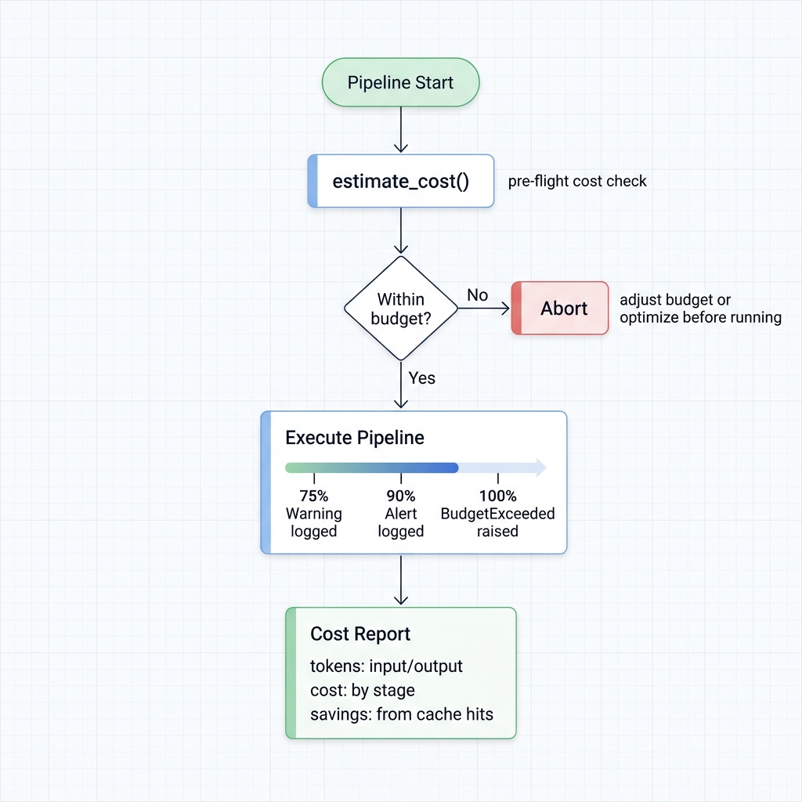

# Cost Estimation & Budgets

LLM APIs bill per token, and it adds up fast. A 5M-row dataset through GPT-4 can easily cost hundreds of dollars. Ondine gives you three levers: **estimate before you run**, **cap spending with hard budgets**, and **cut costs with batching and caching**.



## Estimate Before You Spend

Always check the price tag first:

```python
from ondine import PipelineBuilder

pipeline = (
    PipelineBuilder.create()
    .from_csv("data.csv", input_columns=["text"], output_columns=["summary"])
    .with_prompt("Summarize: {text}")
    .with_llm(provider="openai", model="gpt-4o-mini")
    .build()
)

estimate = pipeline.estimate_cost()

print(f"Total rows: {estimate.total_rows}")
print(f"Estimated tokens: {estimate.estimated_tokens}")
print(f"Estimated cost: ${estimate.total_cost:.4f}")
print(f"Cost per row: ${estimate.cost_per_row:.6f}")
```

If the number looks wrong, fix the prompt or switch models before burning real money.

## Budget Limits

Hard caps. The pipeline stops when the budget runs out:

```python
from decimal import Decimal

pipeline = (
    PipelineBuilder.create()
    .from_csv("data.csv", ...)
    .with_prompt("...")
    .with_llm(provider="openai", model="gpt-4o-mini")
    .with_max_budget(Decimal("10.0"))  # Max $10 USD
    .build()
)

result = pipeline.execute()
```

During execution, Ondine tracks spend against three thresholds: 75% (warning logged), 90% (alert logged), 100% (`BudgetExceeded` raised, pipeline stops). Pair this with [checkpointing](checkpointing.md) so you can resume after adjusting the budget.

---

## Cutting Costs

Six techniques, ranked by impact.

### 1. Multi-Row Batching

The biggest win. Instead of one API call per row, pack 100 rows into a single call:

```python
# Without batching: 5M rows = 5M API calls (~69 hours)
pipeline = (
    PipelineBuilder.create()
    .from_csv("data.csv", input_columns=["text"])
    .with_prompt("Classify: {text}")
    .with_llm(provider="openai", model="gpt-4o-mini")
    .build()
)

# With batching: 5M rows = 50K API calls (~42 minutes)
pipeline = (
    PipelineBuilder.create()
    .from_csv("data.csv", input_columns=["text"])
    .with_prompt("Classify: {text}")
    .with_batch_size(100)  # 100 rows per API call
    .with_llm(provider="openai", model="gpt-4o-mini")
    .build()
)
```

Token cost stays the same, but you eliminate API call overhead entirely. Start with `batch_size=10` and scale up:

- Simple classification prompts: 50-500 rows/batch
- Complex extraction prompts: 10-50 rows/batch

See `examples/21_multi_row_batching.py` for the full walkthrough.

### 2. Prefix Caching

Separate your static instructions from per-row data. Providers cache the static part and only charge for the dynamic portion:

```python
# Bad: system instructions baked into every prompt
pipeline = (
    PipelineBuilder.create()
    .with_prompt("""You are a sentiment classifier.
Classify as: positive, negative, or neutral.
Return only the label.

Review: {text}
Sentiment:""")  # Entire prompt sent every time
    .with_llm(provider="openai", model="gpt-4o-mini")
    .build()
)

# Good: system prompt cached by the provider
pipeline = (
    PipelineBuilder.create()
    .with_prompt("Review: {text}\nSentiment:")           # Dynamic only
    .with_system_prompt("""You are a sentiment classifier.
Classify as: positive, negative, or neutral.
Return only the label.""")                                # Cached
    .with_llm(provider="openai", model="gpt-4o-mini")
    .build()
)
```

Real numbers for 5,000 rows with a 500-token system prompt:

| Approach | Tokens billed | Cost (GPT-4o-mini) | Savings |
|---|---|---|---|
| Without caching | 2.75M | $0.41 | -- |
| With caching | 250K | $0.04 | **90%** |

Provider support varies:

| Provider | Caching | Savings on cached tokens | Latency drop |
|---|---|---|---|
| OpenAI | Automatic | 50% | ~50% |
| Anthropic | Automatic | 90% | ~85% |
| Azure OpenAI | Automatic | 50% | ~50% |
| Groq | Not supported | -- | -- |

Verify it's working by checking average tokens per row after execution:

```python
result = pipeline.execute()
avg = result.costs.total_tokens / result.metrics.processed_rows
print(f"Avg tokens/row: {avg:.0f}")  # Should be ~50-100, not ~550
```

See [`examples/20_prefix_caching.py`](../../examples/20_prefix_caching.py) for a working example.

### 3. Combine Batching + Caching

Stack them. This is where the real savings hit:

```python
pipeline = (
    PipelineBuilder.create()
    .with_prompt("Classify: {text}")
    .with_system_prompt("You are a classifier.")  # Cached
    .with_batch_size(100)                          # 100x fewer calls
    .with_llm(provider="openai", model="gpt-4o-mini")
    .build()
)
```

### 4. Pick Cheaper Models

Not every task needs GPT-4:

| Provider | Model | Cost (per 1M tokens) | Best for |
|---|---|---|---|
| OpenAI | gpt-4o-mini | $0.15 | General-purpose |
| Groq | llama-3.3-70b | $0.05-0.10 | Speed + cost |
| Together.AI | various | $0.20-0.60 | Open models |
| Local MLX | any | $0 | Apple Silicon, privacy |

```python
# $0.03/1K tokens
.with_llm(provider="openai", model="gpt-5.4")

# $0.0001/1K tokens (300x cheaper)
.with_llm(provider="openai", model="gpt-4o-mini")

# $0 -- runs on your laptop
.with_llm(provider="mlx", model="mlx-community/Qwen2.5-7B-Instruct-4bit")
```

### 5. Write Shorter Prompts

Every token in your prompt gets billed. Be concise:

```python
# 47 tokens -- verbose
prompt = """
You are a helpful assistant specialized in text summarization.
Please carefully read the following text and provide a comprehensive
summary that captures the main points while being concise.

Text: {text}

Please provide your summary below:
"""

# 7 tokens
prompt = "Summarize in 1 sentence: {text}"
```

Also: set `temperature=0.0` for deterministic tasks (shorter, more focused output) and cap response length with `max_tokens`:

```python
.with_llm(
    provider="openai",
    model="gpt-4o-mini",
    temperature=0.0,
    max_tokens=100
)
```

### 6. Response Caching

If your dataset has duplicate inputs, don't pay twice. See the [Caching guide](caching.md) for disk and Redis caching.

---

## Cost Tracking

### During Execution

```python
result = pipeline.execute()

print(f"Total cost: ${result.costs.total_cost:.4f}")
print(f"Input tokens: {result.costs.input_tokens:,}")
print(f"Output tokens: {result.costs.output_tokens:,}")
print(f"Cost per row: ${result.costs.total_cost / result.metrics.processed_rows:.6f}")
```

### Across Multiple Runs

```python
from ondine.utils import CostTracker

tracker = CostTracker()

for config in pipeline_configs:
    pipeline = build_pipeline(config)
    result = pipeline.execute()

    tracker.add(
        provider=config["provider"],
        model=config["model"],
        cost=result.costs.total_cost,
        tokens=result.costs.total_tokens,
    )

summary = tracker.summary()
print(f"Total spend: ${summary['total_cost']:.2f}")
print(f"Total tokens: {summary['total_tokens']:,}")
```

### Export to CSV

```python
import pandas as pd

cost_report = pd.DataFrame([{
    "date": pd.Timestamp.now(),
    "rows": result.metrics.processed_rows,
    "total_cost": result.costs.total_cost,
    "input_tokens": result.costs.input_tokens,
    "output_tokens": result.costs.output_tokens,
    "provider": "openai",
    "model": "gpt-4o-mini",
}])

cost_report.to_csv("cost_log.csv", mode="a", header=False, index=False)
```

## Budget-Aware Workflows

### Estimate-Then-Execute Pattern

```python
def safe_execute(pipeline, max_cost=10.0):
    estimate = pipeline.estimate_cost()

    if estimate.total_cost > max_cost:
        print(f"Estimated cost ${estimate.total_cost:.2f} exceeds budget ${max_cost:.2f}")
        return None

    print(f"Proceeding with estimated cost: ${estimate.total_cost:.2f}")
    return pipeline.execute()

result = safe_execute(pipeline, max_cost=5.0)
```

### Streaming with Cost Checks

For large datasets, stream chunks and bail if costs climb too high:

```python
from decimal import Decimal

pipeline = (
    PipelineBuilder.create()
    .from_csv("large_data.csv", ...)
    .with_streaming(chunk_size=1000)
    .with_max_budget(Decimal("20.0"))
    .build()
)

total_cost = 0.0
for chunk_result in pipeline.execute_stream():
    total_cost += chunk_result.costs.total_cost
    print(f"Chunk: ${chunk_result.costs.total_cost:.4f}, "
          f"Running total: ${total_cost:.4f}")

    if total_cost > 15.0:
        print("Approaching budget limit, stopping")
        break
```

## Related

- [Caching](caching.md) -- disk and Redis response caching
- [Execution Modes](execution-modes.md) -- async and streaming for large datasets
- [Routing](routing.md) -- multi-provider load balancing and cost-based routing
