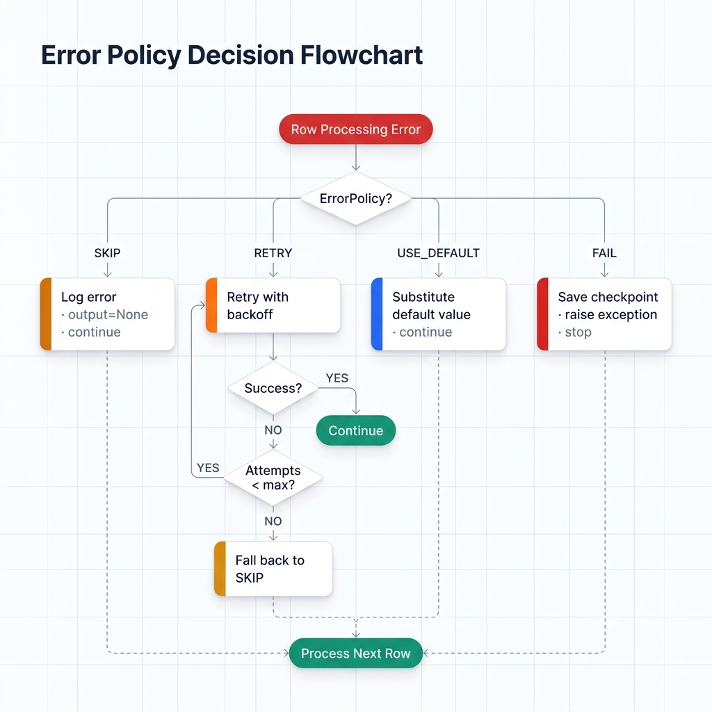
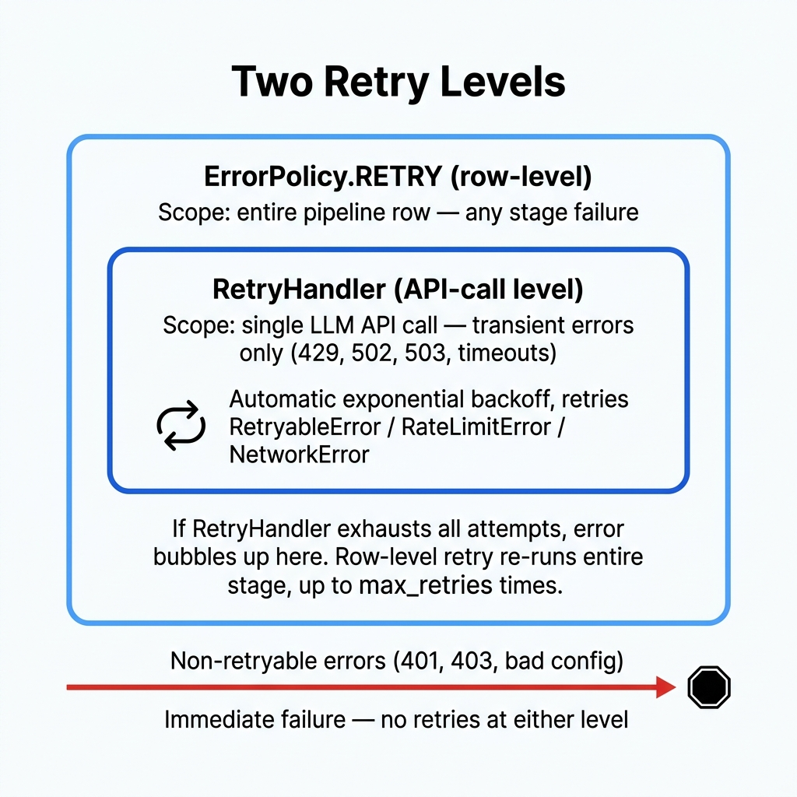

# Error Handling

Two layers. A **policy** decides what happens when a row fails (skip it, retry it, substitute a default, or abort). A **retry handler** deals with transient API errors using exponential backoff. They work together, but they're separate things.

## Quick Reference

| Layer | What it handles | Where configured |
|-------|----------------|-----------------|
| `ErrorPolicy` | Row-level failures: skip, retry, fail, or substitute | `with_error_policy()` |
| `max_retries` | Maximum attempts under the `retry` policy | `with_max_retries()` |
| `retry_delay` | Initial backoff delay in seconds | `ProcessingSpec.retry_delay` |
| `RetryHandler` | Transient API errors (rate limits, network timeouts) | Applied automatically |

<!-- IMAGE_PLACEHOLDER
title: Error Policy Decision Flowchart
type: flowchart
description: A flowchart starting with a rounded-rect node "Row processing error occurs" (red) at the top. An arrow leads down to a diamond decision node "Which ErrorPolicy?". Four arrows branch out from the diamond, each labeled with the policy name. Left branch labeled "SKIP" leads to a node "Log error, set output to None, continue to next row" (yellow). Right branch labeled "FAIL" leads to a node "Save checkpoint, raise exception, pipeline stops" (red). Down-left branch labeled "RETRY" leads to a loop structure: node "Retry attempt (with backoff delay)" (orange), arrow to diamond "Success?", if yes arrow to "Continue to next row" (green), if no arrow to diamond "Attempts < max_retries?", if yes loop back to "Retry attempt", if no arrow to "Fall back to SKIP behavior" (yellow). Down-right branch labeled "USE_DEFAULT" leads to node "Substitute fixed default value for output, continue to next row" (blue). All terminal continue nodes converge with a dashed arrow to a final node "Process next row" (green) at the bottom.
placement: full-width
alt_text: Decision flowchart showing error policy routing: SKIP continues with null, FAIL stops the pipeline, RETRY loops with exponential backoff then falls back to skip, USE_DEFAULT substitutes a fixed value.
-->


## ErrorPolicy

`ErrorPolicy` is a string enum in `ondine.core.specifications`. It tells the pipeline what to do when a stage fails for a given row.

```python
from ondine.core.specifications import ErrorPolicy

# Available values:
ErrorPolicy.SKIP        # "skip"
ErrorPolicy.FAIL        # "fail"
ErrorPolicy.RETRY       # "retry"
ErrorPolicy.USE_DEFAULT # "use_default"
```

### SKIP (default)

Logs the error, leaves the output column empty for that row, moves on.

```python
pipeline = (
    PipelineBuilder.create()
    .from_csv("data.csv", input_columns=["text"], output_columns=["result"])
    .with_prompt("Classify: {text}")
    .with_llm(provider="openai", model="gpt-4o-mini")
    .with_error_policy("skip")
    .build()
)

result = pipeline.execute()
# Failed rows will have None/NaN in the "result" column
failed = result.to_pandas()[result.to_pandas()["result"].isna()]
print(f"{len(failed)} rows failed and were skipped")
```

Good when partial results are fine and you want throughput.

### FAIL

Raises immediately. Stops the pipeline. A checkpoint gets saved before the raise, so you can fix the problem and resume.

```python
pipeline = (
    PipelineBuilder.create()
    .from_csv("data.csv", input_columns=["text"], output_columns=["result"])
    .with_prompt("Classify: {text}")
    .with_llm(provider="openai", model="gpt-4o-mini")
    .with_error_policy("fail")
    .build()
)
```

The right choice for CI pipelines or data validation where any failure means the output is useless.

### RETRY

Retries the failed row up to `max_retries` times. If all attempts are exhausted, falls back to skip behavior.

```python
pipeline = (
    PipelineBuilder.create()
    .from_csv("data.csv", input_columns=["text"], output_columns=["result"])
    .with_prompt("Extract entities: {text}")
    .with_llm(provider="openai", model="gpt-4o-mini")
    .with_error_policy("retry")
    .with_max_retries(3)
    .build()
)
```

The retry policy you'll want for most production use. Rate limits and network hiccups are the norm, not the exception.

### USE_DEFAULT

Returns a fixed default value for any failed row instead of leaving it empty or raising.

```python
from ondine.core.specifications import ProcessingSpec, ErrorPolicy

# Configure via ProcessingSpec directly for use_default
# (pass the spec to PipelineBuilder.with_processing_spec if supported,
#  or combine with a custom stage for the default value)
pipeline = (
    PipelineBuilder.create()
    .from_csv("data.csv", input_columns=["text"], output_columns=["sentiment"])
    .with_prompt("Rate sentiment of: {text}")
    .with_llm(provider="openai", model="gpt-4o-mini")
    .with_error_policy("use_default")
    .build()
)
```

For when downstream consumers can't handle nulls -- dashboards, reports, that kind of thing.

## Configuring Retries

### `with_max_retries(retries: int)`

Maximum retry attempts when the policy is `retry`.

```python
pipeline = (
    PipelineBuilder.create()
    .from_csv("data.csv", input_columns=["text"], output_columns=["result"])
    .with_prompt("Summarise: {text}")
    .with_llm(provider="openai", model="gpt-4o-mini")
    .with_error_policy("retry")
    .with_max_retries(5)
    .build()
)
```

**Default:** `3`. Set to `0` to disable retries entirely.

### `retry_delay` (via `ProcessingSpec`)

Initial delay in seconds between retries. The `RetryHandler` applies exponential backoff: `retry_delay * 2^(attempt - 1)`, capped at 60 seconds.

```python
from ondine.core.specifications import ProcessingSpec, ErrorPolicy

spec = ProcessingSpec(
    max_retries=5,
    retry_delay=2.0,     # First retry waits 2s, second 4s, third 8s, ...
    error_policy=ErrorPolicy.RETRY,
)
```

**Default:** `1.0` seconds.

### Backoff Schedule

With `retry_delay=1.0` and `max_retries=5`:

| Attempt | Delay before attempt |
|---------|---------------------|
| 1 (initial) | -- |
| 2 | 1s |
| 3 | 2s |
| 4 | 4s |
| 5 | 8s |

Cap is 60 seconds no matter the multiplier.

### Honouring `Retry-After`

When a provider returns HTTP 429 with a `Retry-After` header (either a seconds count or an HTTP date), Ondine parses it and waits **at least** that long before the next attempt. This is automatic — no configuration needed. The exponential backoff above is still applied on top, so you'll never sleep *less* than the server asked for.

What this buys you: on shared API keys (OpenAI/Anthropic tier limits, Groq free tier), the server often tells you the exact moment the window reopens. Honouring it avoids the usual "hammer until unblocked" pattern that wastes retry budget and triggers stricter throttling.

## Two Levels of Retry

<!-- IMAGE_PLACEHOLDER
title: Two Retry Levels
type: architecture
description: A diagram with two nested rounded rectangles representing retry scopes. The outer rectangle is labeled "ErrorPolicy.RETRY (row-level)" with a subtitle "Scope: entire pipeline row -- any stage failure". Inside it, a smaller rectangle is labeled "RetryHandler (API-call level)" with a subtitle "Scope: single LLM API call -- transient errors only (429, 502, 503, timeouts)". Inside the inner rectangle, a small loop arrow icon and the text "Automatic exponential backoff, retries RetryableError / RateLimitError / NetworkError". Between the inner and outer rectangles (but still inside the outer one), text reads "If RetryHandler exhausts all attempts, the error bubbles up here. Row-level retry re-runs the entire stage for this row, up to max_retries times." Below both rectangles, a horizontal arrow labeled "Non-retryable errors (401, 403, bad config)" bypasses both boxes and points to a stop sign node labeled "Immediate failure -- no retries at either level".
placement: full-width
alt_text: Architecture diagram showing two nested retry levels: the inner RetryHandler for transient API errors, and the outer ErrorPolicy RETRY for row-level failures, with non-retryable errors bypassing both.
-->


One thing to watch: Ondine has two retry mechanisms at different scopes.

| Mechanism | Scope | Trigger |
|-----------|-------|---------|
| `RetryHandler` | Single LLM API call | Transient errors: rate limits (429), network timeouts, 502/503 |
| `ErrorPolicy.RETRY` | Pipeline row | Any stage failure, after `RetryHandler` is exhausted |

`RetryHandler` fires automatically for transient errors regardless of your `ErrorPolicy`. It only retries `RetryableError`, `RateLimitError`, and `NetworkError` subtypes. Config errors (bad API key, 401, 403) fail immediately -- no retries, no wasted time.

## Handling Partial Failures

With `skip` or `retry`, you get successful rows alongside failed ones. Here's how to inspect what happened:

```python
result = pipeline.execute()
df = result.to_pandas()

# Check overall failure rate
total = result.metrics.total_rows
skipped = result.metrics.total_rows - result.metrics.success_count
print(f"Success rate: {result.metrics.success_count}/{total} ({skipped} skipped)")

# Inspect errors
for err in result.errors:
    print(f"Row {err}: failed")

# Rows with empty outputs (skipped due to error)
failed_rows = df[df["result"].isna()]
print(f"Rows with missing output: {len(failed_rows)}")
```

## Production Patterns

### Skip and Monitor

Max throughput, but alert if too many rows fail:

```python
from ondine import PipelineBuilder

pipeline = (
    PipelineBuilder.create()
    .from_csv(
        "data.csv",
        input_columns=["description"],
        output_columns=["category"],
    )
    .with_prompt("Categorise this product: {description}")
    .with_llm(provider="openai", model="gpt-4o-mini")
    .with_error_policy("skip")
    .with_checkpoint_interval(500)
    .with_max_budget(20.0)
    .build()
)

result = pipeline.execute()
df = result.to_pandas()

failure_rate = 1 - (result.metrics.success_count / result.metrics.total_rows)
if failure_rate > 0.05:
    raise RuntimeError(f"Failure rate {failure_rate:.1%} exceeds 5% threshold")

df.to_csv("output.csv", index=False)
```

### Retry with Backoff

The setup you'll want for high-volume jobs against rate-limited APIs:

```python
from ondine import PipelineBuilder
from ondine.core.specifications import ProcessingSpec, ErrorPolicy

processing = ProcessingSpec(
    batch_size=50,
    concurrency=5,
    error_policy=ErrorPolicy.RETRY,
    max_retries=5,
    retry_delay=2.0,          # 2s → 4s → 8s → 16s → 32s
    checkpoint_interval=250,
    rate_limit_rpm=60,
)

pipeline = (
    PipelineBuilder.create()
    .from_csv("data.csv", input_columns=["text"], output_columns=["result"])
    .with_prompt("Analyse sentiment: {text}")
    .with_llm(provider="openai", model="gpt-4o-mini")
    .build()
)
# Attach the custom processing spec
pipeline.specifications.processing = processing

result = pipeline.execute()
```

### Fail Fast

For data-quality pipelines where partial results are worse than no results:

```python
from ondine import PipelineBuilder

pipeline = (
    PipelineBuilder.create()
    .from_csv("validated_input.csv", input_columns=["text"], output_columns=["label"])
    .with_prompt("Label this text: {text}")
    .with_llm(provider="anthropic", model="claude-sonnet-4-20250514")
    .with_error_policy("fail")
    .with_checkpoint_dir(".checkpoints/labelling-job")
    .build()
)

try:
    result = pipeline.execute()
except Exception as e:
    print(f"Pipeline aborted: {e}")
    print("Fix the issue and resume from the checkpoint printed above.")
```

### Retry + Checkpointing Together

Multi-hour jobs need both. A failure mid-run shouldn't mean losing hours of completed work.

```python
from ondine import PipelineBuilder

pipeline = (
    PipelineBuilder.create()
    .from_csv(
        "large_dataset.csv",
        input_columns=["text"],
        output_columns=["summary"],
    )
    .with_prompt("Summarise the following: {text}")
    .with_llm(provider="openai", model="gpt-4o-mini")
    .with_error_policy("retry")
    .with_max_retries(3)
    .with_checkpoint_dir(".checkpoints/summary-job")
    .with_checkpoint_interval(500)
    .with_checkpoint_cleanup(False)  # Retain in case downstream write fails
    .with_max_budget(100.0)
    .build()
)

result = pipeline.execute()
```

## Distributed Rate Limiting (Redis)

`with_rate_limit(rpm)` gives you an in-process token bucket. That's enough for a single pipeline but breaks down when several jobs share one API key — each job runs its own bucket, so N parallel workers allow N×rpm against the provider.

Pass a `redis_url` and a `scope` to share one bucket across every worker pointed at it:

```python
pipeline = (
    PipelineBuilder.create()
    .from_dataframe(df, input_columns=["text"], output_columns=["result"])
    .with_prompt("Process: {text}")
    .with_llm(provider="openai", model="gpt-4o-mini")
    .with_rate_limit(
        100,
        redis_url="redis://localhost:6379/0",
        scope="openai:gpt-4o-mini",
    )
    .build()
)
```

Workers that must share a budget use the **same** `scope`. Typical format: `"provider:model"` or `"provider:model:tier"`. Two jobs with different scopes get independent buckets even on the same Redis.

**Fallback behaviour.** If Redis becomes unreachable mid-run, the limiter automatically falls back to an in-process bucket at the same `rpm`. A Redis outage cannot deadlock the pipeline — it just loses the cross-worker coordination until Redis returns.

## Non-Retryable Errors

Some errors bypass all retry and skip logic. Pipeline halts immediately regardless of policy:

- Invalid API key / auth failures (`401`, `403`)
- `NonRetryableError` and its subclasses

No point burning retries on a bad API key. Fix the config, re-run.

## Related

- [Checkpointing](checkpointing.md) -- saving state so failed pipelines can resume
- [Cost Control](cost-control.md) -- budget limits that complement fault-tolerance settings
- [Execution Modes](execution-modes.md) -- async and streaming modes for large datasets
