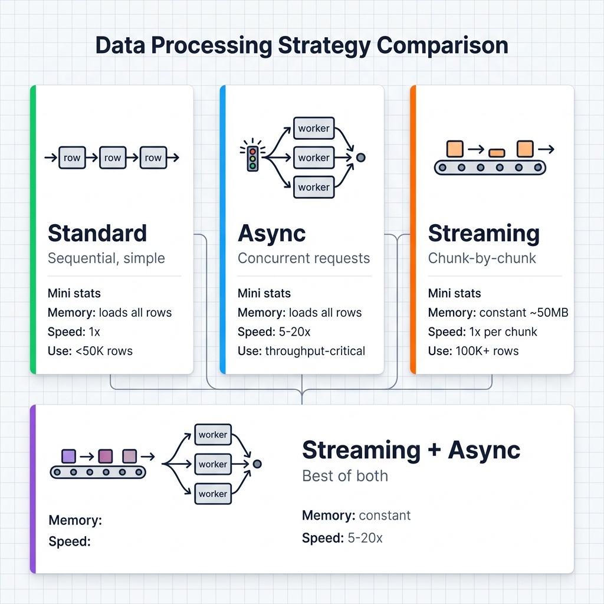

# Async & Streaming

Three execution modes. Which one depends on dataset size and how much you care about speed vs. memory.

## At a Glance

| Mode | Best For | Memory Usage | Throughput | Complexity |
|------|----------|--------------|------------|------------|
| **Standard** | Small datasets (< 50K rows) | High | Low-Medium | Simple |
| **Async** | High throughput needs | High | High | Medium |
| **Streaming** | Large datasets (100K+ rows) | Constant | Medium | Medium |



## Standard (Default)

Sequential, single-threaded. Call `.execute()`, get an `ExecutionResult` back. Nothing to configure.

```python
from ondine import PipelineBuilder

pipeline = (
    PipelineBuilder.create()
    .from_csv("data.csv", input_columns=["text"], output_columns=["result"])
    .with_prompt("Process: {text}")
    .with_llm(provider="openai", model="gpt-4o-mini")
    .with_batch_size(100)
    .build()
)

result = pipeline.execute()
print(f"Processed {result.metrics.processed_rows} rows")
```

Loads the entire dataset into memory, processes rows one batch at a time. Good for anything under 50K rows -- scripts, notebooks, debugging. If the dataset is bigger or you need speed, keep reading.

## Async

Same memory profile as standard, but fires multiple API calls at once. A 10K-row job that takes 120s sequentially drops to ~15s with 20 concurrent requests.

```python
import asyncio
from ondine import PipelineBuilder

async def process_data():
    pipeline = (
        PipelineBuilder.create()
        .from_csv("large_data.csv", input_columns=["text"], output_columns=["result"])
        .with_prompt("Analyze: {text}")
        .with_llm(provider="openai", model="gpt-4o-mini")
        .with_async_execution(max_concurrency=20)
        .with_rate_limit(100)  # respect API limits
        .build()
    )

    result = await pipeline.execute_async()
    print(f"Processed {result.metrics.processed_rows} rows in {result.metrics.elapsed_time:.1f}s")
    return result

result = asyncio.run(process_data())
```

One caveat: more concurrency means you hit rate limits faster. Start low, increase gradually. If the provider throttles you, you'll see 429s in the logs.

### Concurrency Guidelines

| Provider | Recommended Max Concurrency |
|----------|----------------------------|
| OpenAI (Tier 1) | 10-20 |
| OpenAI (Tier 4+) | 50-100 |
| Anthropic | 10-20 |
| Groq | 30-50 |
| Azure OpenAI | 10-30 (varies by deployment) |
| Local MLX | 1 (no concurrency benefit) |

## Streaming

Standard and async both load the full dataset into memory. That breaks once you hit 100K+ rows. Streaming processes fixed-size chunks: only 1-2 chunks in memory at any point.

The tradeoff: you get an iterator of `ExecutionResult` objects (one per chunk) instead of a single result. Write output incrementally -- don't collect everything into a list and defeat the purpose.

```python
from ondine import PipelineBuilder

pipeline = (
    PipelineBuilder.create()
    .from_csv(
        "huge_dataset.csv",  # 500K rows
        input_columns=["text"],
        output_columns=["summary"]
    )
    .with_prompt("Summarize: {text}")
    .with_llm(provider="openai", model="gpt-4o-mini")
    .with_streaming(chunk_size=5000)
    .build()
)

total_cost = 0.0
for i, chunk_result in enumerate(pipeline.execute_stream()):
    total_cost += chunk_result.costs.total_cost
    print(f"Chunk {i+1}: {len(chunk_result.data)} rows, running cost: ${total_cost:.4f}")

    mode = "w" if i == 0 else "a"
    chunk_result.data.to_csv("output.csv", mode=mode, header=(i == 0), index=False)

print(f"Done. ${total_cost:.2f} total.")
```

### Chunk Size Guidelines

| Dataset Size | Recommended Chunk Size |
|-------------|------------------------|
| 10K-50K | 1,000 |
| 50K-100K | 2,500 |
| 100K-500K | 5,000 |
| 500K-1M | 10,000 |
| 1M+ | 25,000 |

Larger chunks = fewer overhead, smaller chunks = finer progress tracking.

## Streaming + Async (Maximum Efficiency)

Combine streaming with async for both memory efficiency and high throughput:

```python
pipeline = (
    PipelineBuilder.create()
    .from_csv("huge_dataset.csv", ...)
    .with_streaming(chunk_size=5000)
    .with_async_execution(max_concurrency=20)
    .build()
)

async for chunk_result in pipeline.execute_stream_async():
    # Each chunk processed with 20 concurrent requests
    print(f"Chunk done: {len(chunk_result.data)} rows")
```

## Comparison Example

Processing the same 10K row dataset with different modes:

### Standard Mode
```python
# Loads all 10K rows into memory, processes sequentially
result = pipeline.execute()
# Time: ~120s, Memory: ~500MB peak
```

### Async Mode
```python
# Loads all 10K rows into memory, 20 concurrent requests
result = await pipeline.execute_async()
# Time: ~15s, Memory: ~500MB peak
```

### Streaming Mode
```python
# Processes 1K rows at a time
for chunk in pipeline.execute_stream():
    pass
# Time: ~110s, Memory: ~50MB constant
```

### Streaming + Async
```python
# Processes 1K rows at a time with 20 concurrent requests per chunk
async for chunk in pipeline.execute_stream_async():
    pass
# Time: ~18s, Memory: ~50MB constant
```

## Choosing the Right Mode

Use this decision tree:

```
Is dataset > 100K rows?
├─ YES → Use Streaming
│         └─ Need speed? → Add Async (streaming + async)
│
└─ NO → Dataset < 100K rows
         ├─ Need maximum speed?
         │  └─ YES → Use Async
         │
         └─ NO → Use Standard (simplest)
```

## Memory Considerations

### Standard/Async Memory Usage

```
Memory = Base + (Dataset Size × Row Size)
```

Example: 50K rows × 10KB/row = ~500MB

### Streaming Memory Usage

```
Memory = Base + (Chunk Size × Row Size)
```

Example: 1K chunk × 10KB/row = ~10MB (constant)

## Practical Tips

Regardless of mode: enable [checkpointing](checkpointing.md) and set a [budget cap](cost-control.md). Failures happen. You don't want to re-process 80K rows because row 80,001 hit a rate limit.

**Async specifically:** start at `max_concurrency=10`, bump it up in increments. If you jump straight to 100, most providers will throttle you and your effective throughput drops. Each concurrent request holds its response in memory too, so watch your footprint on large outputs.

**Streaming specifically:** pick a chunk size that balances progress granularity vs. overhead. A 500K-row dataset with `chunk_size=100` means 5,000 chunk iterations -- that's a lot of overhead for small gains. See the chunk size table above.

## Related

- [`examples/07_async_execution.py`](../../examples/07_async_execution.py) -- Async processing
- [`examples/08_streaming_large_files.py`](../../examples/08_streaming_large_files.py) -- Streaming
- [Cost Estimation & Budgets](cost-control.md) -- Budget management
- [API Reference](../api/pipeline.md) -- Complete API docs
