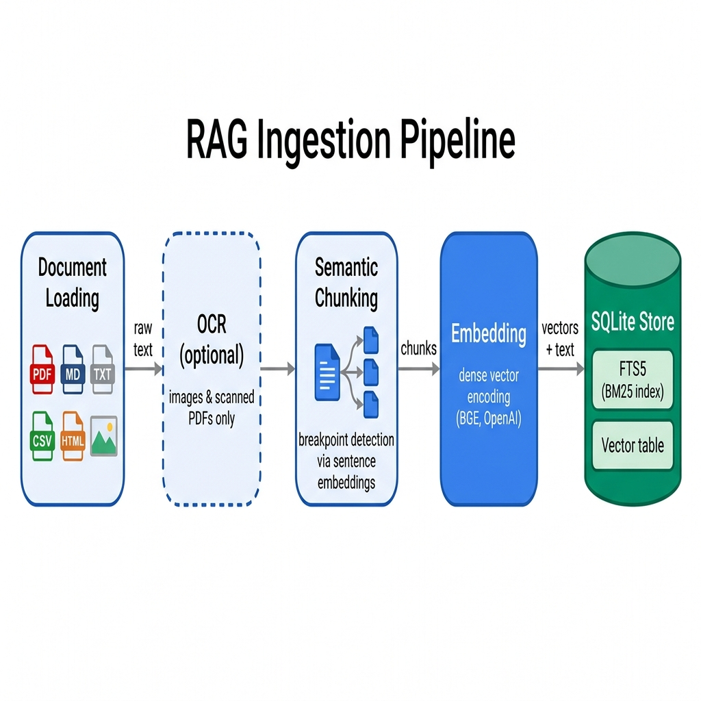
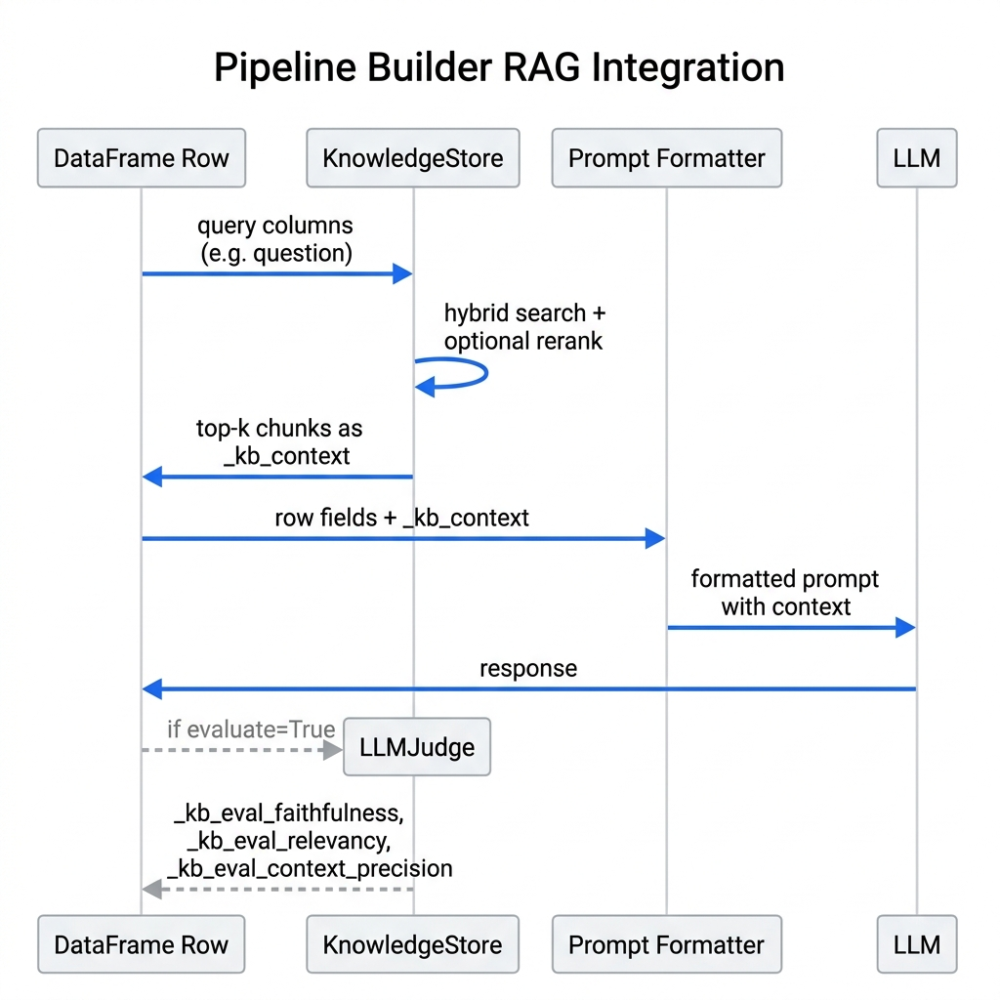
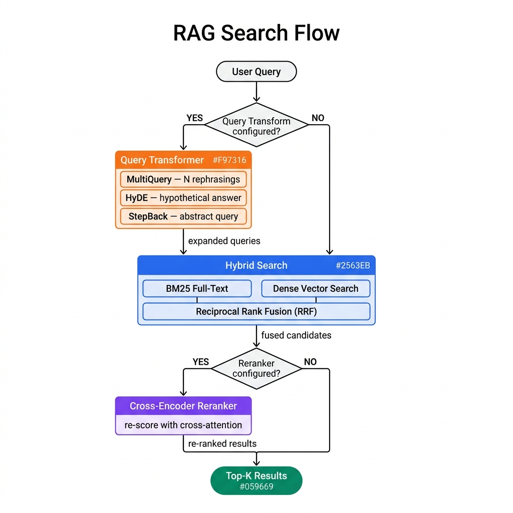

# Knowledge Base & RAG Guide

`KnowledgeStore` gives you RAG in two method calls: `ingest()` your documents, `search()` them with hybrid BM25 + dense vector retrieval, and let the pipeline inject context into prompts for you.

## Quick Start

```python
from ondine.knowledge import KnowledgeStore

# Create a persistent knowledge base (or use ":memory:" for tests)
kb = KnowledgeStore("knowledge.db")

# Ingest a directory of documents
kb.ingest("docs/")

# Search
results = kb.search("How does authentication work?", limit=5)
for r in results:
    print(f"[{r.score:.2f}] {r.source}: {r.text[:120]}...")
```

That covers ingest, search, and results. Everything below is configuration and fine-tuning.

## What it does under the hood

The full RAG lifecycle, handled for you:

- **Ingestion** -- PDF, Markdown, plain text, CSV, HTML, image files
- **Chunking** -- splits documents at semantic breakpoints
- **Embedding** -- encodes chunks as dense vectors
- **Hybrid search** -- BM25 full-text + dense vector retrieval, fused via Reciprocal Rank Fusion (RRF)
- **Reranking** -- cross-encoder re-scoring for higher precision
- **Query transformation** -- expands or rewrites queries before retrieval
- **OCR** -- pulls text from images and scanned PDFs
- **Evaluation** -- scores RAG answers on faithfulness, relevancy, and context precision with an LLM judge

<!-- IMAGE_PLACEHOLDER
title: RAG Ingestion Pipeline
type: data-flow
description: A left-to-right data flow diagram showing the document ingestion pipeline. Five sequential stages connected by arrows: (1) "Document Loading" box on the far left — labeled with file icons for PDF, MD, TXT, CSV, HTML, images; an arrow labeled "raw text" points right to (2) "OCR" box (dashed border, indicating optional) — labeled "images & scanned PDFs only"; arrow points right to (3) "Semantic Chunking" box — inside show a document splitting into 3 smaller pieces, label "breakpoint detection via sentence embeddings"; arrow labeled "chunks" points right to (4) "Embedding" box — label "dense vector encoding (e.g. BGE, OpenAI)"; arrow labeled "vectors + text" points right to (5) "SQLite Store" cylinder — two compartments inside labeled "FTS5 (BM25 index)" and "Vector table". Use a blue color palette for processing boxes and a green cylinder for the store.
placement: full-width
alt_text: Data flow diagram showing the RAG ingestion pipeline: documents are loaded, optionally OCR-processed, split into semantic chunks, embedded as dense vectors, and stored in SQLite with both BM25 and vector indexes.
-->


## Installation

```bash
pip install 'ondine[knowledge]'
```

Gets you `pymupdf` (PDF extraction) and `sentence-transformers` (local embeddings + cross-encoder reranking).

For API-based embedders, rerankers, query transformers, and OCR:

```bash
pip install litellm
```

Offline OCR options:

```bash
# Tesseract (requires the tesseract binary on your PATH)
pip install pytesseract Pillow

# DocTR deep-learning OCR
pip install python-doctr
```

## Using with the Pipeline Builder

The most common pattern -- attach a `KnowledgeStore` to a pipeline so every row gets augmented with retrieved context automatically:

```python
import pandas as pd
from ondine import PipelineBuilder
from ondine.knowledge import KnowledgeStore

# Build and populate the knowledge base
kb = KnowledgeStore("knowledge.db")
kb.ingest("docs/")

# Build a RAG pipeline
pipeline = (
    PipelineBuilder.create()
    .from_dataframe(
        df,
        input_columns=["question"],
        output_columns=["answer"],
    )
    .with_knowledge_base(kb, top_k=5)
    .with_prompt(
        "Answer the question using only the context provided.\n\n"
        "Context:\n{_kb_context}\n\n"
        "Question: {question}\n\nAnswer:"
    )
    .with_llm(provider="openai", model="gpt-4o-mini")
    .build()
)

result = pipeline.execute()
```

The pipeline inserts a retrieval stage before prompt formatting. Each row's query columns get concatenated, searched against the knowledge base, and the top chunks land in the `{_kb_context}` template variable.

<!-- IMAGE_PLACEHOLDER
title: Pipeline Builder RAG Integration
type: sequence-diagram
description: A left-to-right sequence diagram showing how with_knowledge_base() injects context into each pipeline row. Four vertical swim lanes labeled "DataFrame Row", "KnowledgeStore", "Prompt Formatter", and "LLM". (1) DataFrame Row sends arrow labeled "query columns (e.g. question)" to KnowledgeStore. (2) KnowledgeStore performs internal steps shown as a self-loop labeled "hybrid search + optional rerank". (3) KnowledgeStore sends arrow labeled "top-k chunks as _kb_context" back to DataFrame Row. (4) DataFrame Row sends arrow labeled "row fields + _kb_context" to Prompt Formatter. (5) Prompt Formatter sends arrow labeled "formatted prompt with context injected" to LLM. (6) LLM sends arrow labeled "response" back to DataFrame Row. (7) Optional dashed arrow from DataFrame Row to a box labeled "LLMJudge" with return arrow labeled "_kb_eval_faithfulness, _kb_eval_relevancy, _kb_eval_context_precision" (labeled "if evaluate=True"). Use blue for the main flow arrows and gray dashed for the optional evaluation path.
placement: full-width
alt_text: Sequence diagram showing how the pipeline builder retrieves knowledge base context for each row, injects it into the prompt template as _kb_context, sends to the LLM, and optionally evaluates the response.
-->


## KnowledgeStore

### Constructor

```python
KnowledgeStore(
    db_path: str = ":memory:",
    *,
    chunker: SemanticChunker | None = None,
    embedder: Embedder | str | None = None,
    reranker: Reranker | str | bool | None = None,
    query_transform: QueryTransformer | str | None = None,
    ocr: OCRProvider | str | None = None,
    extract_pdf_images: bool = False,
)
```

| Parameter | Type | Default | Description |
|-----------|------|---------|-------------|
| `db_path` | `str` | `":memory:"` | SQLite file path or `":memory:"` for an in-process store |
| `chunker` | `SemanticChunker \| None` | `None` | Custom chunker; `None` uses `SemanticChunker()` defaults |
| `embedder` | `Embedder \| str \| None` | `None` | Embedding model; `None` auto-detects `SentenceTransformerEmbedder` if available |
| `reranker` | `Reranker \| str \| bool \| None` | `None` | Reranker to apply after retrieval; `False`/`None` disables, `True` uses the default cross-encoder |
| `query_transform` | `QueryTransformer \| str \| None` | `None` | Query expansion strategy; `None` disables |
| `ocr` | `OCRProvider \| str \| None` | `None` | OCR provider for image files; `None` skips images during ingest |
| `extract_pdf_images` | `bool` | `False` | When `True` and `ocr` is configured, also OCR embedded images in PDFs |

### Ingestion methods

```python
# Load from a file or directory (recursive)
kb.ingest(path: str | Path) -> int

# Ingest pre-loaded Document objects
kb.ingest_documents(docs: list[Document]) -> int

# Ingest raw text without file I/O
kb.ingest_text(text: str, source: str = "inline", metadata: dict | None = None) -> int
```

All three return the number of chunks stored.

### Search

```python
kb.search(query: str, limit: int = 5) -> list[SearchResult]
```

Returns `SearchResult` objects:

```python
@dataclass(frozen=True)
class SearchResult:
    chunk_id: str
    text: str
    source: str
    score: float
    metadata: dict
```

### Properties

```python
kb.chunk_count  # int: number of chunks currently stored
```

## Document Loading

`KnowledgeStore.ingest()` delegates to `DocumentLoader`, which dispatches by file extension:

| Extension(s) | Reader | Extra required |
|---|---|---|
| `.pdf` | PyMuPDF | `ondine[knowledge]` |
| `.md`, `.txt`, `.csv`, `.tsv`, `.json`, `.xml`, `.html`, `.htm` | stdlib text reader | -- |
| `.png`, `.jpg`, `.jpeg`, `.webp`, `.tiff`, `.bmp`, `.gif` | OCR provider | OCR configured |

Point `kb.ingest("docs/")` at a directory and it picks up all supported files recursively.

### Loading text inline

```python
kb.ingest_text(
    text="All orders ship within 2 business days.",
    source="policy/shipping.md",
    metadata={"section": "shipping"},
)
```

### Loading pre-built Document objects

Use `ingest_documents()` when you want to control text extraction yourself:

```python
from ondine.knowledge import KnowledgeStore
from ondine.knowledge.loader import Document

docs = [
    Document(text="...", source="custom://page-1", metadata={"page": 1}),
    Document(text="...", source="custom://page-2", metadata={"page": 2}),
]

kb = KnowledgeStore(":memory:")
kb.ingest_documents(docs)
```

`Document` is a frozen dataclass: `text: str`, `source: str`, `metadata: dict`.

## Chunking

`SemanticChunker` splits documents by detecting breakpoints where sentence-level embeddings diverge. If `sentence-transformers` isn't installed, it falls back to fixed-size sentence-count windows. No crash, just coarser splits.

### Default behaviour

```python
from ondine.knowledge import KnowledgeStore

# Uses SemanticChunker with default settings
kb = KnowledgeStore("knowledge.db")
```

### Customising the chunker

```python
from ondine.knowledge import KnowledgeStore
from ondine.knowledge.chunker import SemanticChunker

chunker = SemanticChunker(
    max_chunk_tokens=256,       # soft upper bound per chunk (whitespace tokens)
    breakpoint_percentile=0.20, # lower = more splits; 0.0–1.0
    model_name="all-MiniLM-L6-v2",  # sentence-transformers model for breakpoint detection
)

kb = KnowledgeStore("knowledge.db", chunker=chunker)
```

| Parameter | Default | Description |
|-----------|---------|-------------|
| `max_chunk_tokens` | `512` | Soft upper bound on chunk size in whitespace tokens |
| `breakpoint_percentile` | `0.25` | Percentile threshold for breakpoint detection. Lower = more, smaller chunks |
| `model_name` | `"all-MiniLM-L6-v2"` | `sentence-transformers` model for similarity scoring during splitting |

## Embedding Models

Embeddings power dense vector search. Without an embedder, `KnowledgeStore` falls back to BM25 only.

### Auto-detection (default)

Pass `embedder=None` (or don't pass it at all) and the store tries to load `SentenceTransformerEmbedder("BAAI/bge-base-en-v1.5")`. If `sentence-transformers` isn't installed, embeddings get silently disabled -- you still get BM25.

### SentenceTransformerEmbedder (local)

```python
from ondine.knowledge import KnowledgeStore, SentenceTransformerEmbedder

kb = KnowledgeStore(
    "knowledge.db",
    embedder=SentenceTransformerEmbedder("BAAI/bge-large-en-v1.5"),
)
```

Or just pass the model name:

```python
kb = KnowledgeStore("knowledge.db", embedder="BAAI/bge-large-en-v1.5")
```

The model loads lazily on the first embed call.

### OpenAIEmbedder (API-based)

Routes through `litellm`, so it works with OpenAI, Cohere, Azure, and any other litellm-supported provider:

```python
from ondine.knowledge import KnowledgeStore, OpenAIEmbedder

kb = KnowledgeStore(
    "knowledge.db",
    embedder=OpenAIEmbedder(
        model="text-embedding-3-small",
        api_key="sk-...",     # optional; falls back to OPENAI_API_KEY env var  # pragma: allowlist secret
        dimensions=1536,      # optional; reduce dimensions for smaller vectors
    ),
)
```

If your string contains `"text-embedding"`, it auto-selects `OpenAIEmbedder`:

```python
kb = KnowledgeStore("knowledge.db", embedder="text-embedding-3-small")
```

### Custom embedder

Any object with `embed(texts: list[str]) -> list[list[float]]` works:

```python
class MyEmbedder:
    def embed(self, texts: list[str]) -> list[list[float]]:
        # your implementation
        ...

kb = KnowledgeStore("knowledge.db", embedder=MyEmbedder())
```

## Reranking

Reranking re-scores your initial hybrid-search candidates with a cross-attention model. Better precision, one extra inference step.

### Enable with default cross-encoder

```python
kb = KnowledgeStore("knowledge.db", reranker=True)
```

Uses `CrossEncoderReranker("cross-encoder/ms-marco-MiniLM-L-12-v2")`.

### CrossEncoderReranker (local)

```python
from ondine.knowledge import KnowledgeStore, CrossEncoderReranker

kb = KnowledgeStore(
    "knowledge.db",
    reranker=CrossEncoderReranker(
        model_name="cross-encoder/ms-marco-MiniLM-L-12-v2",
        top_k=5,
    ),
)
```

Or pass the model name:

```python
kb = KnowledgeStore("knowledge.db", reranker="cross-encoder/ms-marco-MiniLM-L-12-v2")
```

### JinaReranker (API-based)

```python
from ondine.knowledge import KnowledgeStore, JinaReranker

kb = KnowledgeStore(
    "knowledge.db",
    reranker=JinaReranker(
        model="jina-reranker-v2-base-multilingual",
        top_k=5,
        api_key="jina_...",   # or set JINA_API_KEY env var  # pragma: allowlist secret
    ),
)
```

A string containing `"jina"` also selects `JinaReranker`:

```python
kb = KnowledgeStore("knowledge.db", reranker="jina-reranker-v2-base-multilingual")
```

### Custom reranker

Any object with `rerank(query: str, results: list, top_k: int | None) -> list`:

```python
class MyReranker:
    def rerank(self, query: str, results: list, top_k: int | None = None) -> list:
        ...

kb = KnowledgeStore("knowledge.db", reranker=MyReranker())
```

## Query Transformation

Query transformers rewrite or expand the query before retrieval. The store runs hybrid search for each expanded query, deduplicates, then optionally reranks the merged set.

All three built-in transformers need `litellm` and an API key for the underlying LLM.

### MultiQueryTransformer

Generates N rephrasings of the original query. Retrieval unions results across all variants -- good for ambiguous queries where a single phrasing misses relevant docs.

```python
from ondine.knowledge import KnowledgeStore, MultiQueryTransformer

kb = KnowledgeStore(
    "knowledge.db",
    query_transform=MultiQueryTransformer(
        model="openai/gpt-4o-mini",
        n=3,                    # number of rephrasings to generate
        api_key="sk-...",       # optional  # pragma: allowlist secret
    ),
)
```

Shortcut:

```python
kb = KnowledgeStore("knowledge.db", query_transform="multi-query")
```

The transformer asks the LLM for a JSON array of `n` alternative formulations. Each one gets searched independently; results merge and deduplicate before reranking.

### HyDETransformer

Hypothetical Document Embeddings. The LLM generates a short hypothetical answer to your query, and that answer becomes the retrieval query. Because the hypothesis sits closer in embedding space to relevant passages than the raw question does, dense retrieval gets a real boost.

```python
from ondine.knowledge import KnowledgeStore, HyDETransformer

kb = KnowledgeStore(
    "knowledge.db",
    query_transform=HyDETransformer(
        model="openai/gpt-4o-mini",
        api_key="sk-...",       # optional  # pragma: allowlist secret
    ),
)
```

Or:

```python
kb = KnowledgeStore("knowledge.db", query_transform="hyde")
```

Returns `[original_query, hypothesis]`. Both get searched; results merge before reranking.

### StepBackTransformer

Generates a more abstract version of your query so retrieval can surface broader context that the specific query would miss.

```python
from ondine.knowledge import KnowledgeStore, StepBackTransformer

kb = KnowledgeStore(
    "knowledge.db",
    query_transform=StepBackTransformer(
        model="openai/gpt-4o-mini",
        api_key="sk-...",       # optional  # pragma: allowlist secret
    ),
)
```

Or:

```python
kb = KnowledgeStore("knowledge.db", query_transform="step-back")
```

Returns `[original_query, step_back_query]`. Both searched; results merged.

### Combining reranking and query transformation

```python
kb = KnowledgeStore(
    "knowledge.db",
    embedder="BAAI/bge-base-en-v1.5",
    reranker=True,
    query_transform="hyde",
)
kb.ingest("docs/")

results = kb.search("what are the rate limits for the API?", limit=5)
```

Here's what happens at search time:
1. `HyDETransformer` produces `[original_query, hypothesis]`
2. Hybrid search runs for each variant; results get deduplicated
3. `CrossEncoderReranker` re-scores the merged set and returns top-5

<!-- IMAGE_PLACEHOLDER
title: RAG Search Flow
type: flowchart
description: A top-to-bottom flowchart showing the full search path. Start with a "User Query" rounded box at the top. Arrow down to a diamond decision node labeled "Query Transform configured?". Yes branch goes right to a "Query Transformer" box (show three sub-labels stacked: "MultiQuery — N rephrasings", "HyDE — hypothetical answer", "StepBack — abstract query"); arrow from transformer labeled "expanded queries" goes down. No branch goes straight down. Both paths converge at a "Hybrid Search" box split into two parallel lanes: left lane "BM25 Full-Text" and right lane "Dense Vector Search", both feeding into a merge point labeled "Reciprocal Rank Fusion (RRF)". Arrow labeled "fused candidates" goes down to another diamond "Reranker configured?". Yes goes right to "Cross-Encoder Reranker" box labeled "re-score with cross-attention"; arrow labeled "re-ranked results" goes down. No goes straight down. Both converge at a "Top-K Results" rounded box at the bottom. Use orange for query transformation boxes, blue for search boxes, purple for reranker, and green for the final results.
placement: full-width
alt_text: Flowchart showing the RAG search flow: user query optionally passes through query transformation, then hybrid search combines BM25 and dense vector retrieval via RRF, optionally reranks with a cross-encoder, and returns top-K results.
-->


## OCR Support

OCR providers extract text from image files (`.png`, `.jpg`, `.webp`, etc.) and optionally from images embedded inside PDFs.

### VisionOCR (multimodal LLM)

Uses a vision-capable LLM via `litellm`. Best quality for complex layouts, charts, and tables.

```python
from ondine.knowledge import KnowledgeStore, VisionOCR

kb = KnowledgeStore(
    "knowledge.db",
    ocr=VisionOCR(
        model="gpt-4o",
        api_key="sk-...",   # optional  # pragma: allowlist secret
    ),
)
kb.ingest("scanned_docs/")
```

Shortcut `"vision"` defaults to `gpt-4o`:

```python
kb = KnowledgeStore("knowledge.db", ocr="vision")
```

Any litellm model name works too:

```python
kb = KnowledgeStore("knowledge.db", ocr="anthropic/claude-3-5-sonnet-20241022")
```

### TesseractOCR (local, offline)

Needs the `tesseract` binary on your PATH plus `pytesseract` and `Pillow`.

```bash
# macOS
brew install tesseract

# Debian/Ubuntu
sudo apt install tesseract-ocr
```

```python
from ondine.knowledge import KnowledgeStore, TesseractOCR

kb = KnowledgeStore(
    "knowledge.db",
    ocr=TesseractOCR(
        lang="eng",     # Tesseract language code
        config="",      # extra Tesseract CLI flags
    ),
)
```

Or:

```python
kb = KnowledgeStore("knowledge.db", ocr="tesseract")
```

### DocTROCR (local, deep-learning)

High-accuracy local OCR tuned for documents and screenshots. Needs `python-doctr`.

```python
from ondine.knowledge import KnowledgeStore, DocTROCR

kb = KnowledgeStore(
    "knowledge.db",
    ocr=DocTROCR(
        det_arch="db_resnet50",
        reco_arch="crnn_vgg16_bn",
    ),
)
```

Or:

```python
kb = KnowledgeStore("knowledge.db", ocr="doctr")
```

### Extracting images embedded in PDFs

Set `extract_pdf_images=True` alongside any OCR provider:

```python
kb = KnowledgeStore(
    "knowledge.db",
    ocr="vision",
    extract_pdf_images=True,
)
kb.ingest("reports/")  # text pages + embedded diagrams/screenshots are all indexed
```

Chunks from embedded images carry `{"format": "pdf_image", "extraction": "ocr", "page": N, "image_index": M}` in their metadata.

### Custom OCR provider

Any object with `extract_text(image_path: str) -> str`:

```python
class MyOCR:
    def extract_text(self, image_path: str) -> str:
        ...

kb = KnowledgeStore("knowledge.db", ocr=MyOCR())
```

## Pipeline Builder Integration

### `with_knowledge_base()`

```python
PipelineBuilder.with_knowledge_base(
    store: KnowledgeStore,
    *,
    query_columns: list[str] | None = None,
    top_k: int = 3,
    rerank: bool = False,
    reranker_model: str = "cross-encoder/ms-marco-MiniLM-L-12-v2",
    query_transform: str | None = None,
    evaluate: bool = False,
    eval_model: str = "openai/gpt-4o-mini",
) -> PipelineBuilder
```

| Parameter | Default | Description |
|-----------|---------|-------------|
| `store` | required | A pre-built `KnowledgeStore` instance |
| `query_columns` | `None` | Input columns to concatenate as the search query. `None` uses all input columns |
| `top_k` | `3` | Number of chunks to retrieve per row |
| `rerank` | `False` | Enable cross-encoder reranking of retrieved chunks |
| `reranker_model` | `"cross-encoder/ms-marco-MiniLM-L-12-v2"` | Model for reranking (only used when `rerank=True`) |
| `query_transform` | `None` | Query expansion strategy: `"multi-query"`, `"hyde"`, `"step-back"`, or `None` |
| `evaluate` | `False` | Run LLM-as-judge evaluation; adds `_kb_eval_*` columns to results |
| `eval_model` | `"openai/gpt-4o-mini"` | LLM for evaluation (only used when `evaluate=True`) |

`{_kb_context}` gets injected into the prompt template automatically -- it holds the top-k retrieved chunks joined with newlines.

### Full pipeline example

```python
from ondine import PipelineBuilder
from ondine.knowledge import KnowledgeStore

# Build the knowledge base once
kb = KnowledgeStore("support_kb.db", embedder="BAAI/bge-base-en-v1.5")
kb.ingest("help_articles/")

# Build the pipeline
pipeline = (
    PipelineBuilder.create()
    .from_csv(
        "customer_questions.csv",
        input_columns=["question"],
        output_columns=["answer"],
    )
    .with_knowledge_base(
        kb,
        top_k=5,
        rerank=True,
        query_transform="hyde",
        evaluate=True,
    )
    .with_prompt(
        "You are a helpful support agent. Use only the context below.\n\n"
        "Context:\n{_kb_context}\n\n"
        "Question: {question}\n\nAnswer:"
    )
    .with_llm(provider="openai", model="gpt-4o-mini", temperature=0.0)
    .build()
)

result = pipeline.execute()
print(result.data[["question", "answer"]].to_string())
```

## Evaluation

`LLMJudge` scores a RAG answer on three dimensions.

### Using LLMJudge directly

```python
from ondine.knowledge.eval import LLMJudge

judge = LLMJudge(
    model="openai/gpt-4o-mini",
    api_key="sk-...",    # optional; falls back to env var  # pragma: allowlist secret
    temperature=0.0,
)

result = judge.score(
    query="What is the return window for perishables?",
    answer="Perishable items must be returned within 7 days.",
    contexts=["Perishable items must be returned within 7 days of purchase."],
)

print(result.faithfulness)       # 0.0–1.0
print(result.relevancy)          # 0.0–1.0
print(result.context_precision)  # 0.0–1.0
```

`EvalResult` is a frozen dataclass:

```python
@dataclass(frozen=True)
class EvalResult:
    faithfulness: float        # is the answer grounded in the contexts?
    relevancy: float           # does the answer address the query?
    context_precision: float   # are the retrieved contexts relevant?
    metadata: dict
```

### Automated evaluation in a pipeline

Pass `evaluate=True` to `with_knowledge_base()`. The pipeline runs the judge after each LLM call and adds three columns: `_kb_eval_faithfulness`, `_kb_eval_relevancy`, `_kb_eval_context_precision`.

```python
pipeline = (
    PipelineBuilder.create()
    .from_csv("questions.csv", input_columns=["question"], output_columns=["answer"])
    .with_knowledge_base(kb, top_k=5, evaluate=True, eval_model="openai/gpt-4o-mini")
    .with_prompt("Context:\n{_kb_context}\n\nQuestion: {question}\n\nAnswer:")
    .with_llm(model="openai/gpt-4o-mini")
    .build()
)

result = pipeline.execute()
eval_cols = ["question", "answer", "_kb_eval_faithfulness", "_kb_eval_relevancy", "_kb_eval_context_precision"]
print(result.data[eval_cols].to_string())
```

### Custom evaluator

Any object with `score(query: str, answer: str, contexts: list[str]) -> EvalResult` satisfies the `RetrievalScorer` protocol.

## Persistent vs In-Memory Storage

```python
# In-memory: fast, no disk I/O, lost when the process exits
kb = KnowledgeStore(":memory:")

# Persistent: survives restarts, shareable across pipelines
kb = KnowledgeStore("knowledge.db")
```

In production, ingest once and reuse the same `db_path`:

```python
# ingest_once.py — run once to populate
kb = KnowledgeStore("knowledge.db")
kb.ingest("docs/")
print(f"Stored {kb.chunk_count} chunks")

# pipeline.py — load and search without re-ingesting
kb = KnowledgeStore("knowledge.db")  # no ingest() call needed
results = kb.search("authentication flow")
```

Re-ingesting large document sets is expensive. Separate the ingest step from query time.

## Supported File Types

| Format | Extensions | Notes |
|--------|-----------|-------|
| PDF | `.pdf` | Requires `ondine[knowledge]`; each page is a separate `Document` |
| Markdown | `.md` | |
| Plain text | `.txt` | |
| CSV / TSV | `.csv`, `.tsv` | Loaded as raw text |
| JSON | `.json` | Loaded as raw text |
| XML / HTML | `.xml`, `.html`, `.htm` | Loaded as raw text |
| Images | `.png`, `.jpg`, `.jpeg`, `.webp`, `.tiff`, `.bmp`, `.gif` | Requires OCR provider |

## Custom Components

All components follow a protocol pattern. Pass any object with the matching method signature -- no subclassing needed.

| Protocol | Method signature | Used for |
|----------|-----------------|----------|
| `Embedder` | `embed(texts: list[str]) -> list[list[float]]` | Dense vector encoding |
| `Reranker` | `rerank(query: str, results: list, top_k: int \| None) -> list` | Result re-scoring |
| `QueryTransformer` | `transform(query: str) -> list[str]` | Query expansion |
| `OCRProvider` | `extract_text(image_path: str) -> str` | Image-to-text extraction |
| `RetrievalScorer` | `score(query: str, answer: str, contexts: list[str]) -> EvalResult` | RAG evaluation |

## Practical Tips

**Chunk size tradeoffs.** Smaller chunks (`max_chunk_tokens=256`) sharpen precision but lose surrounding context. Larger chunks (`512-1024`) preserve context but dilute relevance scores. Start with 512 (the default) and tune from there based on eval scores.

**Embedder choice.** `BAAI/bge-base-en-v1.5` (the default) is solid for most use cases. Switch to `text-embedding-3-small` if you want API-based embeddings and don't want local GPU/CPU overhead.

**Turn on reranking for anything real.** `reranker=True` runs a cross-encoder locally -- no API cost -- and the precision improvement is usually significant.

**Picking a query transform.** `"hyde"` works well for QA where queries are questions and documents are factual. `"multi-query"` is better for broad, exploratory retrieval. `"step-back"` helps when queries are too specific and miss conceptual matches.

**Stack them.** Reranking and query transformation play well together. Query transformation widens recall; reranking tightens precision on the merged candidates.

## Troubleshooting

### No results returned

- Check `kb.chunk_count` -- did anything actually get ingested?
- Make sure the file extension is in the supported list.
- Ingesting images with no OCR provider configured? Nothing will happen.

### Low retrieval quality

- Turn on reranking (`reranker=True`).
- Try `query_transform="hyde"` as a first experiment.
- Bump `limit` in `search()` or `top_k` in `with_knowledge_base()` to widen the candidate pool.
- Lower `breakpoint_percentile` in `SemanticChunker` to get smaller, more focused chunks.

### `ImportError: PyMuPDF is required`

`pip install 'ondine[knowledge]'`

### `sentence-transformers not installed; using fixed-size chunking`

Info-level log, not an error. Install `sentence-transformers` (comes with `ondine[knowledge]`) for semantic chunking. Without it, the chunker uses fixed-size windows -- functional but coarser.

### Query transformation has no effect

All query transformers need `litellm` and a valid API key. Make sure `litellm` is installed and the right env var (e.g. `OPENAI_API_KEY`) is set. When a transformer call fails, it logs a warning and falls back to the original query silently.

## API Reference

### `KnowledgeStore`

| Method / Property | Signature | Description |
|---|---|---|
| `ingest` | `(path: str \| Path) -> int` | Load files from a path and store chunks |
| `ingest_documents` | `(docs: list[Document]) -> int` | Chunk and store pre-loaded `Document` objects |
| `ingest_text` | `(text: str, source: str, metadata: dict \| None) -> int` | Store raw text |
| `search` | `(query: str, limit: int = 5) -> list[SearchResult]` | Hybrid search with optional transform and rerank |
| `chunk_count` | `int` (property) | Number of chunks stored |

### `SearchResult`

| Field | Type | Description |
|---|---|---|
| `chunk_id` | `str` | Stable unique identifier |
| `text` | `str` | Chunk text content |
| `source` | `str` | File path or source label |
| `score` | `float` | Retrieval or reranker score |
| `metadata` | `dict` | Document metadata (page number, format, etc.) |

### `EvalResult`

| Field | Type | Description |
|---|---|---|
| `faithfulness` | `float` | 0-1; answer grounded in retrieved context |
| `relevancy` | `float` | 0-1; answer addresses the query |
| `context_precision` | `float` | 0-1; retrieved contexts are relevant |
| `metadata` | `dict` | Evaluator metadata (model used, raw scores) |

## Examples

See `examples/rag_knowledge_base_example.py` for a working example covering inline text ingestion, pipeline-based QA with KB context, cost estimation, and result display.
