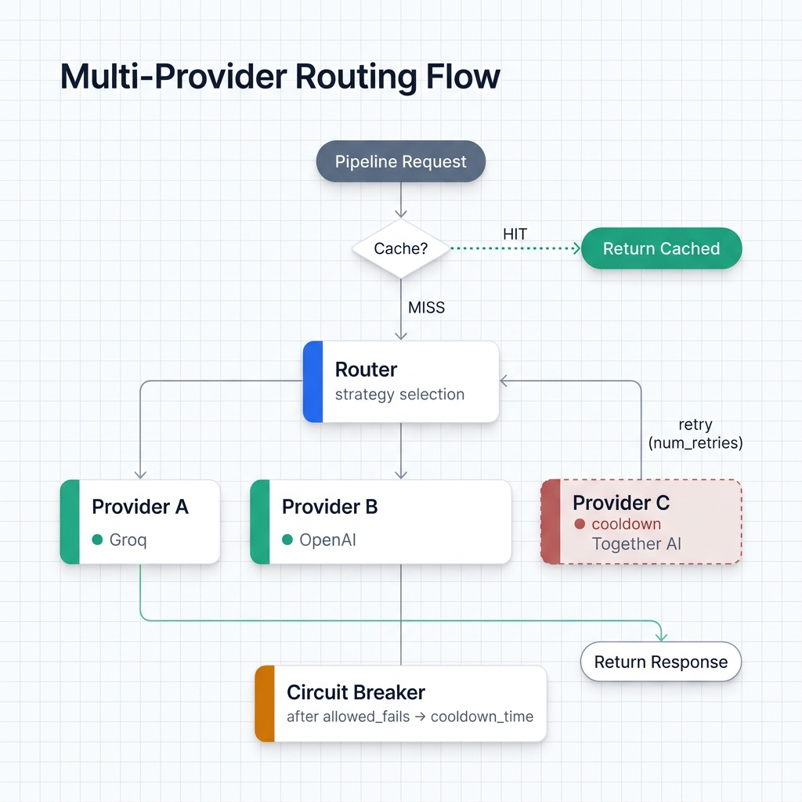
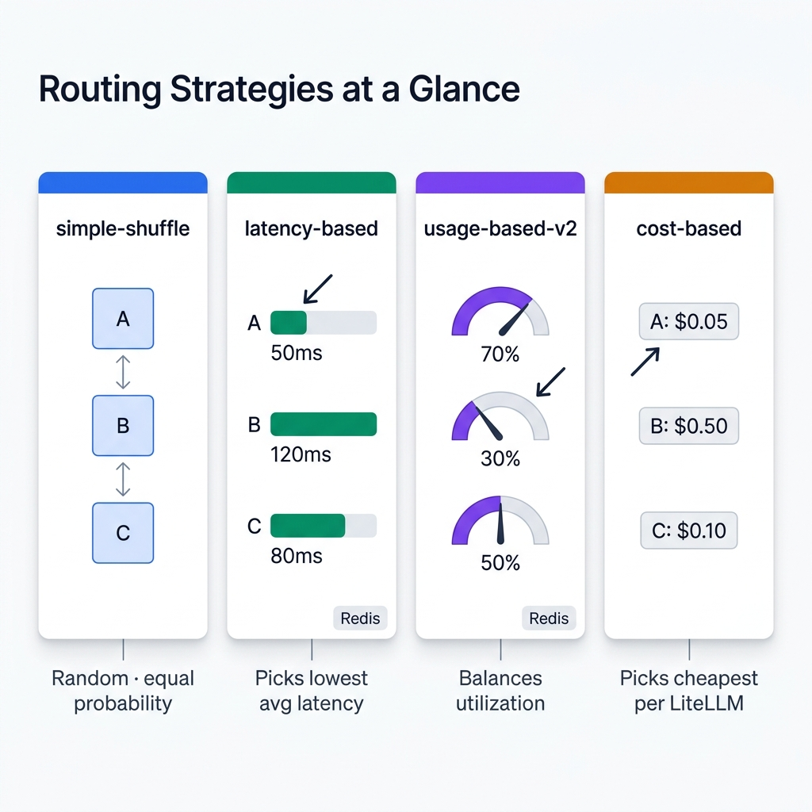

# Routing

LLM routing lets one pipeline spread requests across multiple model deployments (different providers, models, or API keys) with automatic failover, load balancing, and circuit breaking. `with_router()` configures a [LiteLLM Router](https://docs.litellm.ai/docs/routing) under the hood.

---

## What LLM Routing Solves

A single provider has real limits. Rate limits throttle throughput. Outages halt processing. Pricing rarely fits every workload. A router absorbs all of that:

- **Failover** -- Groq starts erroring? Requests automatically shift to OpenAI.
- **Load balancing** -- spread 1,000 concurrent requests across three deployments instead of hammering one.
- **Cost optimization** -- route to the cheapest provider that meets your latency needs.
- **Resilience** -- a circuit breaker pulls failing providers into cooldown instead of retrying forever.

<!-- IMAGE_PLACEHOLDER
title: Multi-Provider Routing Flow
type: flowchart
description: A top-to-bottom flowchart showing the full request lifecycle through the router. Nodes and edges: (1) "Pipeline Request" box at top feeds into (2) "Cache Check" diamond. HIT branch (green, dashed) skips to "Return Cached Response" at bottom right. MISS branch continues to (3) "Router" box (large, emphasized). From the Router, an arrow labeled with the active routing_strategy name goes to (4) a "Strategy Selection" step that fans out to three provider boxes arranged horizontally: "Provider A (Groq)", "Provider B (OpenAI)", "Provider C (Together AI)", each with a small status indicator (green circle = healthy, red circle = cooldown). A solid arrow from Strategy Selection points to whichever provider is selected. From the selected provider, a "Success" arrow (green) goes down to "Return Response + store in cache". A "Failure" arrow (red) loops back to the Router with label "retry (num_retries)" and an additional red arrow from the Router to a "Circuit Breaker" box with label "after allowed_fails failures" which sets the failing provider's indicator to red and label "cooldown_time seconds". Show the retry loop clearly with a curved arrow.
placement: full-width
alt_text: Flowchart showing a pipeline request passing through an optional cache check, then into the router which uses the configured strategy to select among multiple providers, with retry logic and a circuit breaker that puts failing providers into cooldown.
-->


---

## `with_router()`

### Signature

```python
def with_router(
    model_list: list[dict],
    routing_strategy: str = "simple-shuffle",
    timeout: int = 120,
    num_retries: int = 2,
    redis_url: str | None = None,
    allowed_fails: int = 3,
    cooldown_time: int = 60,
    **router_kwargs,
) -> PipelineBuilder
```

### Parameters

| Parameter | Type | Default | Description |
|-----------|------|---------|-------------|
| `model_list` | `list[dict]` | required | Deployment configurations (see below) |
| `routing_strategy` | `str` | `"simple-shuffle"` | Strategy for selecting a deployment per request |
| `timeout` | `int` | `120` | Request timeout in seconds |
| `num_retries` | `int` | `2` | Retry attempts using other deployments on failure |
| `redis_url` | `str \| None` | `None` | Redis URL for distributed state |
| `allowed_fails` | `int` | `3` | Failures before a deployment enters cooldown |
| `cooldown_time` | `int` | `60` | Cooldown duration in seconds |
| `**router_kwargs` | | | Any additional [LiteLLM Router parameter](https://docs.litellm.ai/docs/routing) |

---

## The `model_list` Format

Each entry in `model_list` represents one deployment. The `model_name` field is the logical name the router uses for load balancing. Multiple entries sharing the same `model_name` are treated as interchangeable replicas.

```python
{
    "model_name": "my-model",          # Logical name (shared across replicas)
    "model_id": "groq-llama",          # Optional: friendly ID for tracking
    "litellm_params": {
        "model": "groq/llama-3.3-70b-versatile",  # LiteLLM model string
        "api_key": "...",
        "rpm": 30,                     # Optional: per-deployment rate limit
    }
}
```

Deployments with *different* `model_name` values don't get load-balanced against each other; they're separate pools. For automatic failover, all deployments need the same `model_name`.

---

## Basic Usage

### Failover between two providers

Two deployments, same `model_name`. The router splits traffic between them and fails over if one goes down.

```python
import os
from ondine import PipelineBuilder

pipeline = (
    PipelineBuilder.create()
    .from_csv("data.csv", input_columns=["text"], output_columns=["label"])
    .with_prompt("Classify: {text}")
    .with_router(
        model_list=[
            {
                "model_name": "fast-llm",
                "litellm_params": {
                    "model": "groq/llama-3.3-70b-versatile",
                    "api_key": os.getenv("GROQ_API_KEY"),
                    "rpm": 30,
                },
            },
            {
                "model_name": "fast-llm",  # Same name = automatic failover
                "litellm_params": {
                    "model": "openai/gpt-4o-mini",
                    "api_key": os.getenv("OPENAI_API_KEY"),
                    "rpm": 500,
                },
            },
        ]
    )
    .build()
)

result = pipeline.execute()
```

With `simple-shuffle` and two deployments, traffic splits roughly 50/50. If Groq starts returning errors, the circuit breaker kicks in after 3 failures and puts Groq into a 60-second cooldown. All remaining requests go to OpenAI until Groq recovers.

---

## Routing Strategies

The `routing_strategy` parameter takes any of these values (defined in `RouterStrategy`):

| Strategy | Value | Best for | Redis required |
|----------|-------|----------|----------------|
| Simple shuffle | `"simple-shuffle"` | General use, testing | No |
| Latency-based | `"latency-based-routing"` | Latency-sensitive workloads | Yes |
| Usage-based | `"usage-based-routing"` | Balanced utilization | Yes |
| Usage-based v2 | `"usage-based-routing-v2"` | Production multi-deployment | Yes |
| Cost-based | `"cost-based-routing"` | Minimizing API spend | No |
| Least busy | `"least-busy"` | Deployments with different capacities | Yes |
| Weighted pick | `"weighted-pick"` | Explicit traffic splits | No |

You can also import `RouterStrategy` for IDE autocompletion:

```python
from ondine.core.router_strategies import RouterStrategy

.with_router(
    model_list=[...],
    routing_strategy=RouterStrategy.LATENCY_BASED,
)
```

<!-- IMAGE_PLACEHOLDER
title: Routing Strategy Comparison
type: comparison-table-visual
description: A visual grid with four columns, one per key strategy. Each column is a mini-diagram showing how that strategy picks a provider from three candidates (A, B, C). COLUMN 1 "simple-shuffle": three provider boxes of equal size with random double-headed arrows between them and a dice icon; label "Random, equal probability". COLUMN 2 "latency-based-routing": three provider boxes with small latency bar charts next to each (A=50ms, B=120ms, C=80ms); a bold arrow points to Provider A (lowest); a Redis icon in the corner; label "Picks lowest avg latency". COLUMN 3 "usage-based-routing-v2": three provider boxes with usage meters (A=70% full, B=30% full, C=50% full); a bold arrow points to Provider B (least used); a Redis icon in the corner; label "Balances utilization across deployments". COLUMN 4 "cost-based-routing": three provider boxes with price tags (A=$0.05, B=$0.50, C=$0.10); a bold arrow points to Provider A (cheapest); label "Picks cheapest per LiteLLM pricing". All four columns sit inside a single rounded rectangle with the header "Routing Strategies at a Glance".
placement: full-width
alt_text: Visual comparison of four routing strategies showing how simple-shuffle picks randomly, latency-based picks the fastest provider, usage-based picks the least utilized, and cost-based picks the cheapest.
-->


### Simple shuffle (default)

Random selection, equal probability. No external state needed. You'll use this one most of the time during development.

```python
.with_router(
    model_list=[...],
    routing_strategy="simple-shuffle",
)
```

### Latency-based routing

Sends each request to whichever deployment has the lowest recorded average latency. Requires Redis to share latency data across workers.

```python
.with_router(
    model_list=[...],
    routing_strategy="latency-based-routing",
    redis_url="redis://localhost:6379",
)
```

### Weighted pick

Routes based on explicit weights. Set a `"weight"` key in `litellm_params` for each deployment. Handy when you want most traffic on a fast free-tier provider with a paid fallback catching the rest.

```python
.with_router(
    model_list=[
        {
            "model_name": "llm",
            "litellm_params": {
                "model": "groq/llama-3.3-70b-versatile",
                "api_key": os.getenv("GROQ_API_KEY"),
                "weight": 8,   # 80% of traffic
            },
        },
        {
            "model_name": "llm",
            "litellm_params": {
                "model": "openai/gpt-4o-mini",
                "api_key": os.getenv("OPENAI_API_KEY"),
                "weight": 2,   # 20% of traffic
            },
        },
    ],
    routing_strategy="weighted-pick",
)
```

### Cost-based routing

Picks the cheapest deployment using LiteLLM's cost database. Costs need to be defined in your `model_list` or in LiteLLM's built-in pricing tables.

```python
.with_router(
    model_list=[
        {
            "model_name": "llm",
            "litellm_params": {
                "model": "groq/llama-3.3-70b-versatile",
                "api_key": os.getenv("GROQ_API_KEY"),
            },
        },
        {
            "model_name": "llm",
            "litellm_params": {
                "model": "openai/gpt-4o",
                "api_key": os.getenv("OPENAI_API_KEY"),
            },
        },
    ],
    routing_strategy="cost-based-routing",
)
```

---

## Circuit Breaker / Resilience

The circuit breaker is on by default. It keeps a failing provider from absorbing requests during an outage.

After **3 consecutive failures** (configurable via `allowed_fails`), the deployment enters cooldown for **60 seconds** (`cooldown_time`). During cooldown, only healthy deployments receive traffic. Once the window expires, the deployment is re-admitted and monitored again.

### Tuning the circuit breaker

```python
# More tolerant -- allow more failures before cooldown
.with_router(
    model_list=[...],
    allowed_fails=5,
    cooldown_time=120,   # Longer cooldown
)

# Stricter -- pull a deployment faster
.with_router(
    model_list=[...],
    allowed_fails=1,
    cooldown_time=30,
)

# Disable circuit breaker entirely (not recommended in production)
.with_router(
    model_list=[...],
    allowed_fails=0,
)
```

---

## Multi-Provider Load Balancing

For high-throughput pipelines, spread load across three or more deployments. Each can carry its own per-deployment rate limit (`rpm`) in `litellm_params`.

```python
import os
from ondine import PipelineBuilder

pipeline = (
    PipelineBuilder.create()
    .from_csv("large_dataset.csv",
              input_columns=["text"],
              output_columns=["category"])
    .with_prompt("Categorize this text: {text}")
    .with_router(
        model_list=[
            {
                "model_name": "classifier",
                "model_id": "groq-primary",
                "litellm_params": {
                    "model": "groq/llama-3.3-70b-versatile",
                    "api_key": os.getenv("GROQ_API_KEY"),
                    "rpm": 25,
                },
            },
            {
                "model_name": "classifier",
                "model_id": "openai-fallback",
                "litellm_params": {
                    "model": "openai/gpt-4o-mini",
                    "api_key": os.getenv("OPENAI_API_KEY"),
                    "rpm": 400,
                },
            },
            {
                "model_name": "classifier",
                "model_id": "together-secondary",
                "litellm_params": {
                    "model": "together_ai/meta-llama/Llama-4-Maverick",
                    "api_key": os.getenv("TOGETHER_API_KEY"),
                    "rpm": 60,
                },
            },
        ],
        routing_strategy="usage-based-routing-v2",
        redis_url="redis://localhost:6379",
        num_retries=2,
        timeout=60,
    )
    .with_concurrency(20)
    .build()
)

result = pipeline.execute()
print(f"Total cost: ${result.costs.total_cost:.4f}")
```

---

## Combining Router with Redis Caching

Pair the router with `with_redis_cache()` so duplicate inputs skip the API entirely. The cache is checked *before* the router picks a deployment, so a hit never touches any provider.

```python
import os
from ondine import PipelineBuilder

pipeline = (
    PipelineBuilder.create()
    .from_csv("support_tickets.csv",
              input_columns=["ticket"],
              output_columns=["category", "priority"])
    .with_prompt("Triage this support ticket: {ticket}")
    .with_system_prompt("Classify into: billing, technical, account, other. Assign priority: high, medium, low.")
    .with_router(
        model_list=[
            {
                "model_name": "triage-model",
                "litellm_params": {
                    "model": "groq/llama-3.3-70b-versatile",
                    "api_key": os.getenv("GROQ_API_KEY"),
                    "rpm": 25,
                },
            },
            {
                "model_name": "triage-model",
                "litellm_params": {
                    "model": "openai/gpt-4o-mini",
                    "api_key": os.getenv("OPENAI_API_KEY"),
                    "rpm": 400,
                },
            },
        ],
        routing_strategy="simple-shuffle",
        allowed_fails=3,
        cooldown_time=60,
    )
    .with_redis_cache(redis_url="redis://localhost:6379", ttl=86400)
    .with_concurrency(15)
    .build()
)
```

---

## Passing Additional LiteLLM Router Parameters

`with_router()` accepts `**router_kwargs`, which pass straight through to LiteLLM Router. Anything documented at [docs.litellm.ai/docs/routing](https://docs.litellm.ai/docs/routing) works here.

```python
.with_router(
    model_list=[...],
    set_verbose=True,            # Enable LiteLLM debug logging
    enable_pre_call_checks=False, # Skip health checks for faster startup
    debug=True,                  # Enable provider tracking
)
```

---

## Deployment Distribution Tracking

Ondine uses an internal `DeploymentTracker` to map LiteLLM's opaque deployment hash IDs back to the `model_id` values from your `model_list`. This drives the progress display during execution, showing which provider handled each request.

To get readable labels in the progress UI, set `model_id` on each entry:

```python
{
    "model_name": "fast-llm",
    "model_id": "groq-llama",      # Displayed in progress output
    "litellm_params": {
        "model": "groq/llama-3.3-70b-versatile",
        ...
    },
}
```

If you skip `model_id`, the router falls back to `model_name` as the label.

---

## Related

- [Caching](caching.md) -- disk and Redis response caching, rate limiting
- [Cost Control](cost-control.md) -- budget limits, prefix caching, token optimization
- [Execution Modes](execution-modes.md) -- concurrency and streaming configuration
