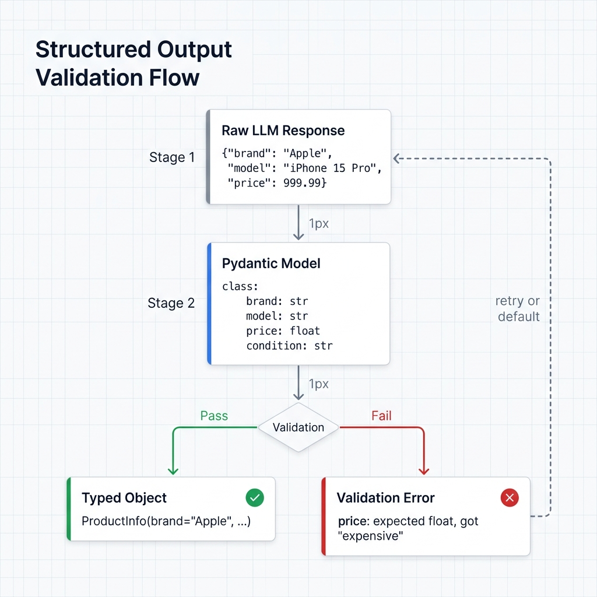

# Structured Output (Pydantic)

LLMs return strings. You need typed data. Define a Pydantic model, and Ondine validates every response against it — wrong types, missing fields, and constraint violations get caught before they reach your code.

```python
# Without: "The brand is Apple and model is iPhone 15 Pro"
# (now go parse that yourself)

# With: ProductInfo(brand="Apple", model="iPhone 15 Pro", price=999.99, condition="new")
# (typed, validated, IDE-autocomplete, done)
```



## Basic Usage

### 1. Define Your Pydantic Model

```python
from pydantic import BaseModel, Field

class ProductInfo(BaseModel):
    brand: str = Field(..., description="Manufacturer name")
    model: str = Field(..., description="Product model")
    price: float = Field(..., gt=0, description="Price in USD")
    condition: str = Field(..., pattern="^(new|used|refurbished)$")
```

### 2. Use with Pipeline

```python
from ondine import PipelineBuilder
from ondine.stages.response_parser_stage import PydanticParser

pipeline = (
    PipelineBuilder.create()
    .from_csv(
        "products.csv",
        input_columns=["product_description"],
        output_columns=["brand", "model", "price", "condition"]
    )
    .with_prompt("""
        Extract product information and return JSON:
        {
          "brand": "manufacturer name",
          "model": "product model",
          "price": 999.99,
          "condition": "new|used|refurbished"
        }

        Description: {product_description}
    """)
    .with_llm(provider="openai", model="gpt-4o-mini", temperature=0.0)
    .with_parser(PydanticParser(ProductInfo, strict=True))
    .build()
)

result = pipeline.execute()
```

### 3. Access Validated Results

```python
# Results are automatically validated
print(result.data)

#    brand           model      price condition
# 0  Apple    iPhone 15 Pro    999.99       new
# 1  Samsung  Galaxy S24      899.99      used
```

## Pydantic Model Examples

### Simple Model

```python
from pydantic import BaseModel

class Sentiment(BaseModel):
    label: str  # "positive", "negative", "neutral"
    confidence: float  # 0.0 to 1.0
```

### Model with Validation

```python
from pydantic import BaseModel, Field, validator

class Review(BaseModel):
    rating: int = Field(..., ge=1, le=5, description="Rating from 1-5")
    sentiment: str = Field(..., pattern="^(positive|negative|neutral)$")
    summary: str = Field(..., min_length=10, max_length=200)

    @validator('rating')
    def rating_must_match_sentiment(cls, v, values):
        sentiment = values.get('sentiment')
        if sentiment == 'positive' and v < 4:
            raise ValueError('Positive sentiment requires rating >= 4')
        if sentiment == 'negative' and v > 2:
            raise ValueError('Negative sentiment requires rating <= 2')
        return v
```

### Nested Model

```python
from pydantic import BaseModel
from typing import List

class Address(BaseModel):
    street: str
    city: str
    country: str
    postal_code: str

class Person(BaseModel):
    name: str
    age: int
    email: str
    addresses: List[Address]
```

### Model with Optional Fields

```python
from pydantic import BaseModel
from typing import Optional

class Product(BaseModel):
    name: str
    brand: str
    price: float
    description: Optional[str] = None  # Optional field
    sku: Optional[str] = None
```

### Model with Enums

```python
from pydantic import BaseModel
from enum import Enum

class Category(str, Enum):
    ELECTRONICS = "electronics"
    CLOTHING = "clothing"
    FOOD = "food"
    BOOKS = "books"

class Item(BaseModel):
    name: str
    category: Category
    price: float
```

## Complete Example

```python
from pydantic import BaseModel, Field
from ondine import PipelineBuilder
from ondine.stages.response_parser_stage import PydanticParser
import pandas as pd

# Define schema
class EmailClassification(BaseModel):
    category: str = Field(..., pattern="^(spam|important|promotional|personal)$")
    confidence: float = Field(..., ge=0.0, le=1.0)
    priority: int = Field(..., ge=1, le=5)
    action: str = Field(..., pattern="^(archive|flag|delete|respond)$")

# Sample data
data = pd.DataFrame({
    "email": [
        "URGENT: You won $1,000,000! Click here now!",
        "Meeting tomorrow at 2pm with the CEO",
        "50% off sale this weekend only!"
    ]
})

# Build pipeline
pipeline = (
    PipelineBuilder.create()
    .from_dataframe(
        data,
        input_columns=["email"],
        output_columns=["category", "confidence", "priority", "action"]
    )
    .with_prompt("""
        Classify this email and return JSON:
        {{
          "category": "spam|important|promotional|personal",
          "confidence": 0.0-1.0,
          "priority": 1-5,
          "action": "archive|flag|delete|respond"
        }}

        Email: {email}
    """)
    .with_llm(provider="openai", model="gpt-4o-mini", temperature=0.0)
    .with_parser(PydanticParser(EmailClassification, strict=True))
    .build()
)

# Execute with type-safe validation
result = pipeline.execute()
print(result.data)
```

**Output:**
```
   email                                   category  confidence  priority   action
0  URGENT: You won $1,000,000! Click...     spam        0.98         5    delete
1  Meeting tomorrow at 2pm with CEO      important      0.95         1      flag
2  50% off sale this weekend only!    promotional      0.92         3   archive
```

## Strict vs Non-Strict Mode

### Strict Mode (Recommended)

```python
.with_parser(PydanticParser(ProductInfo, strict=True))
```

- Validation errors stop processing
- Failed rows are retried (if retry policy configured)
- Guarantees all results match schema

### Non-Strict Mode

```python
.with_parser(PydanticParser(ProductInfo, strict=False))
```

- Validation errors logged but processing continues
- Invalid rows get `None` values
- Useful for exploratory analysis

## Handling Validation Errors

### With Retries

```python
pipeline = (
    PipelineBuilder.create()
    ...
    .with_parser(PydanticParser(ProductInfo, strict=True))
    .with_retry_policy(max_retries=3)  # Retry validation failures
    .build()
)

result = pipeline.execute()

# Check for failed validations
if result.metrics.failed_rows > 0:
    print(f"Failed to validate {result.metrics.failed_rows} rows")
    failed = result.data[result.data['brand'].isna()]
    print(failed)
```

### Custom Error Handling

```python
from pydantic import ValidationError

try:
    result = pipeline.execute()
except ValidationError as e:
    print(f"Validation error: {e}")
    # Handle validation failures
```

## Getting the LLM to Return Clean JSON

The parser does validation, but the LLM still needs to produce valid JSON in the first place. Two things help more than anything else:

**Show the exact shape you expect.** Don't describe the format — show it:

```python
prompt = """
Extract product info and return JSON:
{{
  "brand": "Apple",
  "model": "iPhone 15",
  "price": 999.99
}}

Description: {description}
"""
```

**Set temperature to 0.** Creative responses and structured data don't mix:

```python
.with_llm(provider="openai", model="gpt-4o-mini", temperature=0.0)
```

Also worth doing: put constraint hints in your `Field` descriptions. The LLM sees the schema if the provider supports function calling, and good descriptions act like inline instructions:

```python
class Product(BaseModel):
    brand: str = Field(..., description="Manufacturer name (e.g., Apple, Samsung)")
    price: float = Field(..., description="Price in USD, numeric only")
```

## JSON Parser vs. Pydantic Parser

Two parsers, different guarantees:

```python
from ondine.stages.parser_factory import JSONParser
from ondine.stages.response_parser_stage import PydanticParser

# JSONParser: parses JSON, no validation. Fast prototyping.
.with_parser(JSONParser())

# PydanticParser: parses AND validates against your model. Production use.
.with_parser(PydanticParser(MyModel, strict=True))
```

Use `JSONParser` when you're exploring and the schema might change. Switch to `PydanticParser` once the schema stabilizes and you need guarantees.

## Advanced Patterns

### Multiple Models

For different output types:

```python
from typing import Union

class ShortSummary(BaseModel):
    summary: str = Field(..., max_length=100)

class LongSummary(BaseModel):
    summary: str = Field(..., max_length=500)
    key_points: List[str]

# Use Union types
class SummaryResponse(BaseModel):
    content: Union[ShortSummary, LongSummary]
    type: str
```

### Post-Validation Processing

```python
from pydantic import BaseModel, validator

class Price(BaseModel):
    amount: float
    currency: str = "USD"

    @validator('amount')
    def round_price(cls, v):
        return round(v, 2)

    @property
    def formatted(self) -> str:
        return f"${self.amount:.2f}"
```

### Dynamic Schema

For runtime schema definition:

```python
from pydantic import create_model

# Create model dynamically
fields = {
    "name": (str, ...),
    "age": (int, ...),
    "email": (str, ...)
}

DynamicModel = create_model("DynamicModel", **fields)

pipeline = (
    PipelineBuilder.create()
    ...
    .with_parser(PydanticParser(DynamicModel))
    .build()
)
```

## Performance Considerations

### Validation Overhead

Pydantic validation adds ~1-5ms per row. Negligible for most use cases.

```python
# For 10K rows:
# - Without validation: ~120s
# - With Pydantic: ~120.05s (0.04% overhead)
```

### Complex Models

Deeply nested models increase validation time:

```python
# Simple model: ~1ms
class Simple(BaseModel):
    name: str
    value: float

# Complex nested: ~5ms
class Complex(BaseModel):
    data: List[Dict[str, List[SubModel]]]
```

**Tip:** Keep models as flat as possible for best performance.

## Troubleshooting

### Common Validation Errors

**Missing required field:**
```
ValidationError: field required (type=value_error.missing)
```
Solution: Ensure LLM outputs all required fields in prompt.

**Type mismatch:**
```
ValidationError: value is not a valid float (type=type_error.float)
```
Solution: Add type hints in prompt, use temperature=0.0.

**Pattern mismatch:**
```
ValidationError: string does not match regex (type=value_error.str.regex)
```
Solution: Show valid values in prompt example.

### Debugging Tips

1. **Test with small sample first:**
```python
df_sample = df.head(10)
pipeline = builder.from_dataframe(df_sample, ...).build()
```

2. **Use non-strict mode for debugging:**
```python
.with_parser(PydanticParser(Model, strict=False))
```

3. **Check raw responses:**
```python
# Enable debug logging
import logging
logging.basicConfig(level=logging.DEBUG)
```

## Related

- [API Reference: PydanticParser](../api/stages.md#pydanticparser)
- [Example: 03_structured_output.py](../../examples/03_structured_output.py)
- [Cost Control](cost-control.md) - Optimize costs
- [Multi-Column Processing](multi-column.md) - Multiple outputs
